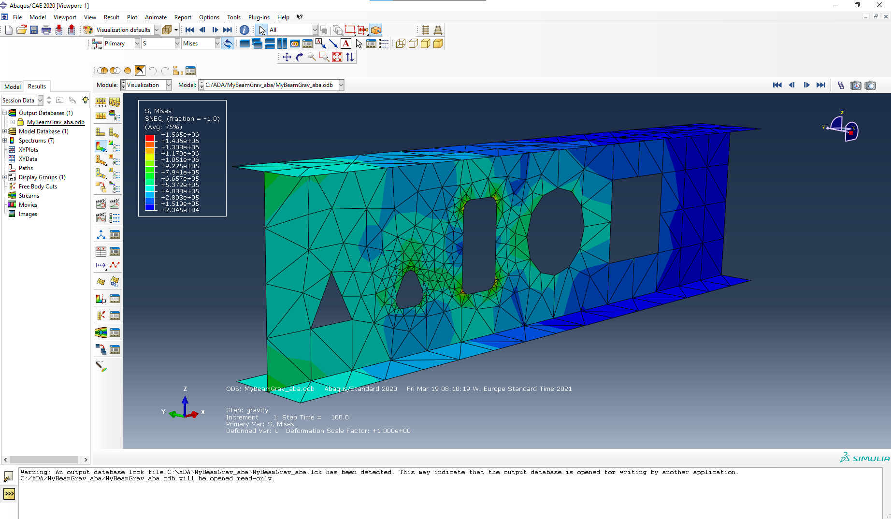

# ADA - Assembly for Design & Analysis

A toolkit for structural analysis and design that focus on interoperability between
IFC and various Finite Element formats.


This library is still undergoing significant development so expect there to be occasional bugs and breaking changes.   

Currently there is only support for Windows. But given that ada is written in pure python and that we believe all 
dependencies are multiplatform we hope to add support for linux and macOS in the future.


## Installation
Here are the steps necessary to install the ada package

Note that it is recommended to create a isolated environment for the installation. For example

```
conda create -n adaenv 
activate adaenv
```

### Using Pypi
To install ada using pip

First you need to have installed `ifcopenshell` and `pythonocc-core` from conda-forge. 

`conda -c conda-forge ifcopenshell pythonocc-core`

After the dependencies are installed you can install ada using 

`pip install ada-py`


### Using Conda (Note! Work in progress)
Note! Conda installation is not yet set up.

To install using conda you can use

`conda install -c krande -conda-forge ada`


## Usage
Some example of using the ada package 

### Create an IFC file

The following code

```python
from ada import Assembly, Part, Beam

a = Assembly("MyAssembly") / (Part("MyPart") / Beam("MyBeam", (0,0,0), (1,0,0), "IPE300"))
a.to_ifc("C:/temp/myifc.ifc")
```

creates an IFC with the following hierarchy (as shown in the figure below taken from the awesome 
[blender](https://blender.org) plugin [blenderbim](https://blenderbim.org/))
    
    MyAssembly (IfSite)
        MyPart (IfcBuildingStorey)
            MyBeam (IfcBeam)


### Create and execute a FEM analysis in Calculix and Abaqus

This example uses a function `beam_ex1` from [here](src/ada/param_models/fem_models.py) that returns an
Assembly object ready to be written to FEM. 

```python
from ada.param_models.fem_models import beam_ex1

a = beam_ex1()

a.to_fem("MyCantilever_abaqus", "abaqus", overwrite=True, execute=True, run_ext=True)
a.to_fem("MyCantilever_calculix", "calculix", overwrite=True, execute=True)
```

after the execution is finished you can look at the results





In short `beam_ex1` creates a `Beam` object which it uses to create a FEM mesh comprised of shell elements using GMSH. 

The current reasoning is to work with a base representation of beam/plates and have the ability
to easily create a FEM representation of any of the base objects in 1D (beam elements), 
2D (shell elements) or 3D (elements) using your own meshing recipes (i.e. not just build a mesh, but a recipe for 
building meshes).


**Note!**

This example assumes you have installed Abaqus and Calculix locally on your computer.

To set correct paths to your installations of Abaqus or Calculix you wish to use there are a few ways of doing so.

1. Add directory path of abaqus.bat or ccx.exe to your system path.
2. Add directory paths to system environment variables. This can be done by using the control panel or running the following from a cmd prompt with administrator rights:
    
```cmd
setx ADA_abaqus_exe <path to your abaqus.bat>
setx ADA_ccx_exe <path to your ccx.exe>
```
3. Set parameters in python by using environment variables or the ada.config.Settings class, like so:

```python
import os
os.environ["ADA_ccx_exe"] = "<path to your ccx.exe>"
os.environ["ADA_abaqus_exe"] = "<path to your abaqus.bat>"
```

or

```python
from ada.config import Settings
Settings.fem_exe_paths["ccx"] = "<path to your ccx.exe>"
Settings.fem_exe_paths["abaqus"] = "<path to your abaqus.bat>"
```

## For developers

For developers interested in contributing to this project feel free to make a fork, experiment and create a pull request
when you have something you would like to add/change/remove. 

Before making a pull request you need to lint with, isort, flake8 and black 

````
pip install black isort flake8
cd src/ada
isort .
flake8 .
black .
````


## Project Responsible ###

	Kristoffer H. Andersen