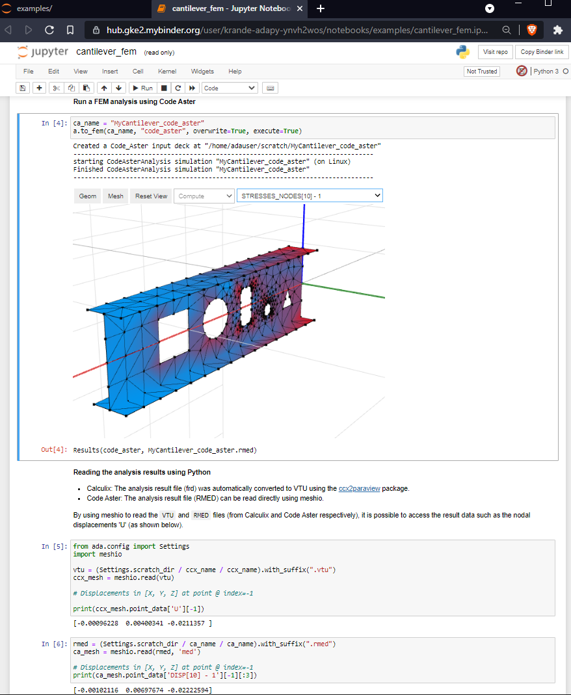

# ADA - Assembly for Design & Analysis

[](https://anaconda.org/krande/ada-py)
[](https://anaconda.org/krande/ada-py)
[](https://anaconda.org/krande/ada-py)
[](https://anaconda.org/krande/ada-py)

A python library for working with structural analysis and design. `Ada-py` delivers an object-oriented framework for 
CAD/BIM/FEM modelling, interoperability and Finite Elements (FE) post-processing.


To install the ada-py package into an existing conda environment

```
conda install -c krande -c conda-forge ada-py
```

**Alternatively** create a new isolated environment for the installation like so:

```
conda create -n ada -c krande -c conda-forge ada-py
```

With `ada-py` you can (among other things) convert your FE models to IFC, create your own recipes for creating FE mesh from
your IFC models, or build your design from the ground up using fully customizable and extendible python classes and 
functions to build parametric designs with rules for automated joint/penetration identification and steel detailing. 

Additionally, you can create unittests to not only test the code that makes your structure, but also create tests 
that checks the capacity of your structure by running FE analysis on it and validating the resulting 
stresses and strains generated by your FE software of choice. 

And since everything is open source and written in regular python you are free to easily 
customize and create whatever design and analysis pipeline of your choosing. 

The FEM formats that has received the most development are Abaqus and Code Aster (the latter being under development 
now), but there is also basic support for Calculix, Sesam and Usfos. There is also support for conversion of FEM meshes 
to/from meshio (which supports many more FEM formats, but does not support FEM information such as beam/shell thickness, 
materials etc..)

Part of the goal is to build the necessary tools for anyone to add support for their favorite FEM format with as 
few lines of code as possible.

This library is still undergoing significant development so expect there to be occasional bugs and breaking changes.

## Quick Links

Try ada-py online (main branch / dev branch) with code-aster and calculix pre-installed

[](https://mybinder.org/v2/gh/Krande/adapy/main) / [](https://mybinder.org/v2/gh/Krande/adapy/dev)




* Feel free to start/join any informal topic related to adapy [here](https://github.com/Krande/adapy/discussions).
* Issues related to adapy can be raised [here](https://github.com/Krande/adapy/issues)


## Usage
Some examples of using the ada package 


### Create an IFC file

The following code

```python
from ada import Assembly, Part, Beam

a = Assembly("MyAssembly") / (Part("MyPart") / Beam("MyBeam", (0, 0, 0), (1, 0, 0), "IPE300"))
a.to_ifc("C:/temp/myifc.ifc")
```

creates an Ifc file containing an IfcBeam with the following hierarchy 
    
    MyAssembly (IfSite)
        MyPart (IfcBuildingStorey)
            MyBeam (IfcBeam)


The resulting IfcBeam (and corresponding hierarchy) shown in the figure above is taken from the awesome 
[blender](https://blender.org) plugin [blenderbim](https://blenderbim.org/).

### Convert between FEM formats

Here is an example showing the code for converting a sesam FEM file to abaqus and code aster

_Note! Reading FEM load and step information is not supported, but might be added in the future._

```python
from ada import Assembly

my_fem_file = 'path_to_your_sesam_file.FEM'

a = Assembly()
a.read_fem(my_fem_file)
a.to_fem('name_of_my_analysis_file_deck_directory_abaqus', 'abaqus')
a.to_fem('name_of_my_analysis_file_deck_directory_code_aster', 'code_aster')

# Note! If you are in a Jupyter Notebook\lab environment 
# this will generate a pythreejs 3D visualization of your FEM mesh
a
```

Current read support is: abaqus, code aster and sesam  
Current write support is: abaqus, code aster and sesam, calculix and usfos

### Create and execute a FEM analysis in Calculix, Code Aster and Abaqus

This example uses a function `beam_ex1` from [here](src/ada/param_models/fem_models.py) that returns an
Assembly object with a single `Beam` with a few holes in it (to demonstrate a small portion of the steel detailing 
capabilities in ada and IFC) converted to a shell element mesh using a FE mesh recipe `create_beam_mesh` found 
[here](ada/fem/io/mesh/recipes.py). 

```python
from ada.param_models.fem_models import beam_ex1

a = beam_ex1()

a.to_fem("MyCantilever_abaqus", "abaqus", overwrite=True, execute=True, run_ext=True)
a.to_fem("MyCantilever_calculix", "calculix", overwrite=True, execute=True)
a.to_fem("MyCantilever_code_aster", "code_aster", overwrite=True, execute=True)
```

after the code is executed you can look at the results using supported post-processing software or directly
in python using Jupyter notebook/lab (currently only supported for Code Aster) for the FEA results.


To access the stress and displacement data directly using python here is a way you can use meshio to read the results 
from Calculix and Code Aster (continuing on the previous example).

```python
from ada.config import Settings
import meshio

vtu = Settings.scratch_dir / "MyCantilever_calculix" / "MyCantilever_calculix.vtu"
mesh = meshio.read(vtu)

# Displacements in [X, Y, Z] at point @ index=-1
print('Calculix:',mesh.point_data['U'][-1])

rmed = Settings.scratch_dir / "MyCantilever_code_aster" / "MyCantilever_code_aster.rmed"
ca_mesh = meshio.read(rmed, 'med')

# Displacements in [X, Y, Z] at point @ index=-1
print('Code Aster:',ca_mesh.point_data['DISP[10] - 1'][-1][:3])
```

**Note!**

The above example assumes you have installed Abaqus, Calculix and Code Aster locally on your computer.

To set correct paths to your installations of FE software you wish to use there are a few ways of doing so.

1. Add directory path of FE executable/batch to your system path.
2. Add directory paths to system environment variables. This can be done by using the control panel or 
   running the following from a cmd prompt with administrator rights:
    
```cmd
:: Windows
setx ADA_abaqus_exe <absolute path to abaqus.bat>
setx ADA_calculix_exe <absolute path to ccx.exe>
setx ADA_code_aster_exe <absolute path to as_run.bat>

:: Linux?

:: Mac?
```
3. Set parameters in python by using environment variables or the ada.config.Settings class, like so:

```python
import os
os.environ["ADA_calculix_exe"] = "<absolute path to ccx.exe>"
os.environ["ADA_abaqus_exe"] = "<absolute path to abaqus.bat>"
os.environ["ADA_code_aster_exe"] = "<absolute path to as_run.bat>"
```

or

```python
from ada.config import Settings
Settings.fem_exe_paths["calculix"] = "<absolute path to ccx.exe>"
Settings.fem_exe_paths["abaqus"] = "<absolute path to abaqus.bat>"
Settings.fem_exe_paths["code_aster"] = "<absolute path to as_run.bat>"
```

Note! It is very important that any paths containing whitespaces be converted to "shortened paths". To shorten a path
on windows you can use the utility [pathcopycopy](https://pathcopycopy.github.io/).

For installation files of open source FEM software such as Calculix and Code Aster, here are some links:

* https://github.com/calculix/cae/releases (calculix CAE for windows/linux)
* https://code-aster-windows.com/download/ (Code Aster for Windows Salome Meca v9.3.0)
* https://www.code-aster.org/spip.php?rubrique21 (Code Aster for Linux)
* https://salome-platform.org/downloads/current-version (Salome v9.6.0 for windows/linux)
* https://prepomax.fs.um.si/downloads/ (PreProMax -> Calculix preprocessor)

## Alternative Installation methods
If you have to use pip you can do:

```
pip install ada-py gmsh
```

**Note!** Pip will not install the required conda packages. Therefore you would also have to do

```
conda install -c conda-forge ifcopenshell pythonocc-core==7.5.1 occt==7.5.1
```

**Note!** pip is not a recommended installation method due to an unstable behaviour often 
manifested as DLL import errors related to the vtk package.

## Acknowledgements

This project would never have been possible without the existing open source python and c++ libraries. 
Although listed in the package dependencies (which is a long list), here are some of the packages that are at the very 
core of adapy;

* Ifcopenshell
* Pythonocc-core
* Gmsh

And the following packages are integral in the interoperability and visualization of FEM results.

* Vtk
* Pythreejs
* Meshio
* Ccx2paraview

A huge thanks to all involved in the development of the packages mentioned here and in the list of packages adapy
depends on.

If you feel that a certain package listed in the adapy dependencies should be listed here please let me know and I will 
update the list :)


## Project Responsible ###

	Kristoffer H. Andersen
