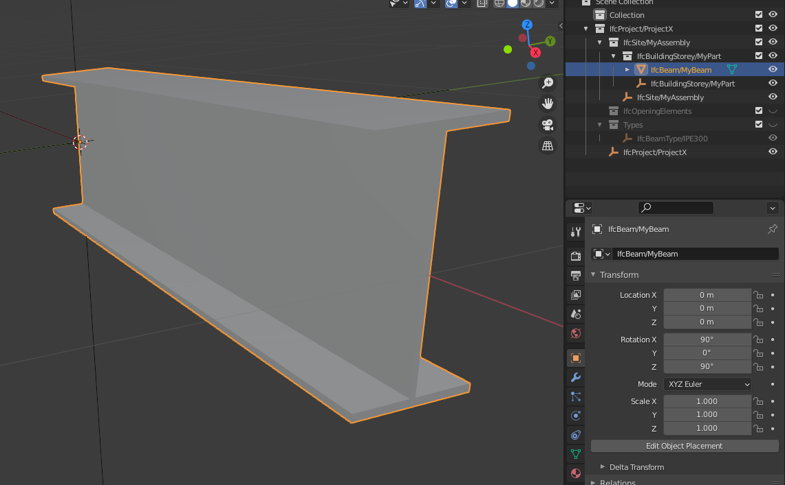

# ADA - Assembly for Design & Analysis

A toolkit for structural analysis and design that focus on 
IFC and various Finite Element formats.

This library is still undergoing significant

## Installation
Here are the steps necessary to install the ada package 

### Using Pypi
To install ada using pip

First you need to have installed `ifcopenshell` and `pythonocc-core` from conda-forge. 
To install use

`conda install -c conda-forge ifcopenshell pythonocc-core`

To install ada from pypi you can use

`pip install ada-py`


### Using Conda (Note! Work in progress)
To install using conda you can use

`conda install -c krande -conda-forge ada`

Note! This is not yet ready. 


## Usage
Here are a few example of using the ada package 

### Create an IFC file

To create an IFC with the hierarchy
    
    MyAssembly (IfSite)
        MyPart (IfcBuildingStorey)
            MyBeam (IfcBeam)

You can do

```python
from ada import Assembly, Part, Beam

a = Assembly('MyAssembly') / (Part('MyPart') / Beam('MyBeam', (0,0,0), (1,0,0), 'IPE300'))
a.to_ifc('C:/temp/myifc.ifc')
```

This will create an IFC file with the desired structure  (as shown in the figure below taken from the awesome 
[blender](https://blender.org) plugin [blenderbim](https://blenderbim.org/))




## For developers

For developers interested in contributing to this project feel free to make a fork, experiment and create a pull request
when you have something you would like to add/change/remove. 

Before making a pull request you need to lint with, isort, flake8 and black 

````
pip install black isort flake8
cd src/ada
isort .
flake8 .
black .
````


## Project Responsible ###

	Kristoffer H. Andersen