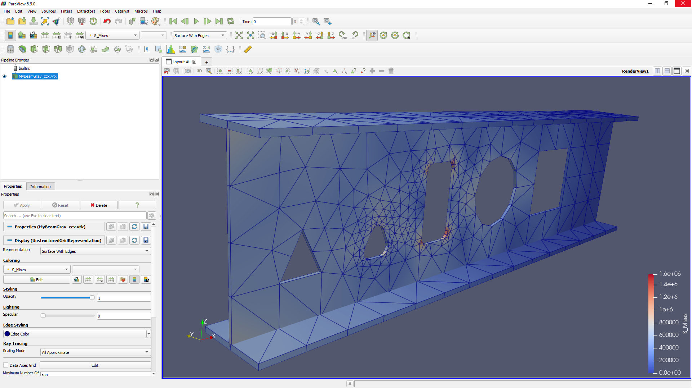
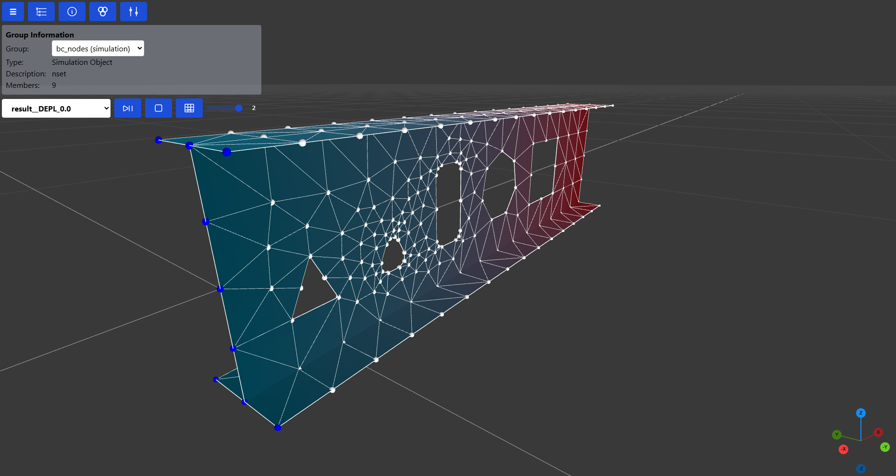

# ADA - Assembly for Design & Analysis

[](https://anaconda.org/conda-forge/ada-py)
[](https://anaconda.org/krande/ada-py)
[](https://anaconda.org/conda-forge/ada-py)
[](https://anaconda.org/conda-forge/ada-py)
[](https://pypi.org/project/ada-py/)

A python library for working with structural analysis and design. This library should be considered as experimental.

The recommended way of installing ada-py is by creating a new isolated environment for the installation like so:

```
mamba create -n adaenv ada-py
```

Here are some of the goals with `ada-py`:

* Support reading, writing and modifying FE models and post-processing FE results
* Support open source and commercial FE packages (based on what I use/would like to use regularly)
* Support scriptable FE meshing
* Support reading/writing CAD/BIM formats (STEP/IFC) & mesh formats (GLTF)
* Use a CSG (Constructive Solid Geometry) core primitives library for boolean operations based on the IFC/STEP standards
* Provide the building blocks for advanced parametric and procedural 3d model design and simulation workflows
* The library should always strive for user ergonomics.

## Quick Links

Try ada-py online with code-aster and calculix pre-installed

[](https://mybinder.org/v2/gh/Krande/adapy/main)


* Feel free to start/join any informal topic related to adapy [here](https://github.com/Krande/adapy/discussions).
* Issues related to adapy can be raised [here](https://github.com/Krande/adapy/issues)


## Usage
Some examples of using the ada-py package 


### Create an IFC file

The following code

```python
from ada import Assembly, Part, Beam

a = Assembly("MyAssembly") / (Part("MyPart") / Beam("MyBeam", (0, 0, 0), (1, 0, 0), "IPE300"))
a.to_ifc("C:/temp/myifc.ifc")
```

creates an Ifc file containing an IfcBeam with the following hierarchy 
    
    MyAssembly (IfSite)
        MyPart (IfcBuildingStorey)
            MyBeam (IfcBeam)


The resulting IfcBeam (and corresponding hierarchy) shown in the figure above is taken from the awesome 
[blender](https://blender.org) plugin [blenderbim](https://blenderbim.org/).

### Convert between FEM formats

Here is an example showing the code for converting a sesam FEM file to abaqus and code aster

_Note! Reading FEM load and step information is not supported, but might be added in the future._

```python
import ada

a = ada.from_fem('path_to_your_sesam_file.FEM')
a.to_fem('name_of_my_analysis_file_deck_directory_abaqus', 'abaqus')
a.to_fem('name_of_my_analysis_file_deck_directory_code_aster', 'code_aster')
```

Current read support is: abaqus, code aster and sesam  
Current write support is: abaqus, code aster and sesam, calculix and usfos

### Create and execute a FEM analysis in Calculix, Code Aster and Abaqus

This example uses a function `beam_ex1` from [here](src/ada/param_models/fem_models.py) that returns an
Assembly object with a single `Beam` with a few holes in it (to demonstrate a small portion of the steel detailing 
capabilities in ada and IFC) converted to a shell element mesh using a FE mesh recipe `create_beam_mesh` found 
[here](ada/fem/io/mesh/recipes.py). 

```python
from ada.param_models.fem_models import beam_ex1

a = beam_ex1()

a.to_fem("MyCantilever_abaqus", "abaqus", overwrite=True, execute=True, run_ext=True)
a.to_fem("MyCantilever_calculix", "calculix", overwrite=True, execute=True)
a.to_fem("MyCantilever_code_aster", "code_aster", overwrite=True, execute=True)
```

after the code is executed you can look at the results using supported post-processing software or directly
in python using Jupyter notebook/lab (currently only supported for Code Aster) for the FEA results.






**Note!**

The above example assumes you have installed Abaqus, Calculix and Code Aster locally on your computer.

To set correct paths to your installations of FE software you wish to use there are a few ways of doing so.

1. Add directory path of FE executable/batch to your system path.
2. Add directory paths to system environment variables. This can be done by using the control panel or 
   running the following from a cmd prompt with administrator rights:
    
```cmd
:: Windows
setx ADA_abaqus_exe <absolute path to abaqus.bat>
setx ADA_calculix_exe <absolute path to ccx.exe>
setx ADA_code_aster_exe <absolute path to as_run.bat>

:: Linux?

:: Mac?
```

Note! It is very important that any paths containing whitespaces be converted to "shortened paths". To shorten a path
on windows you can use the utility [pathcopycopy](https://pathcopycopy.github.io/).

For installation files of open source FEM software such as Calculix and Code Aster, here are some links:

* https://github.com/calculix/cae/releases (calculix CAE for windows/linux)
* https://code-aster-windows.com/download/ (Code Aster for Windows Salome Meca v9.3.0)
* https://www.code-aster.org/spip.php?rubrique21 (Code Aster for Linux)
* https://salome-platform.org/downloads/current-version (Salome v9.6.0 for windows/linux)
* https://prepomax.fs.um.si/downloads/ (PreProMax -> Calculix preprocessor)


## Acknowledgements

This project would never have been possible without the existing open source python and c++ libraries. 
Although listed in the package dependencies (which is a long list), here are some of the packages that are at the very 
core of adapy;

* IfcOpenShell
* OpenCascade
* PythonOCC-Core
* Gmsh
* Trimesh

A huge thanks to all involved in the development of the packages mentioned here and in the list of packages adapy
depends on.

If you feel that a certain package listed in the adapy dependencies should be listed here please let me know and I will 
update the list :)


## Project Responsible ###

	Kristoffer H. Andersen
