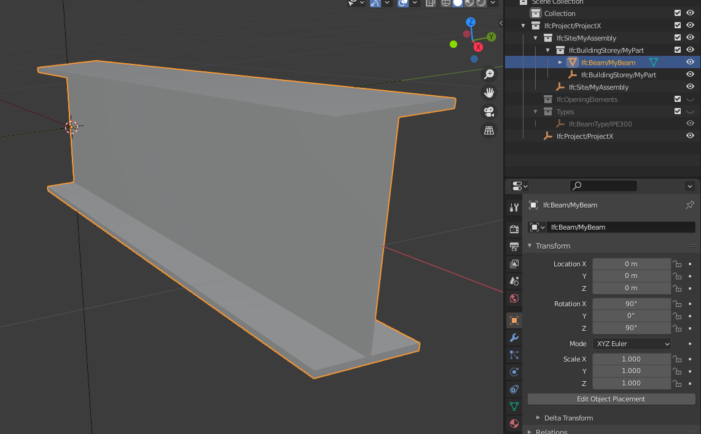
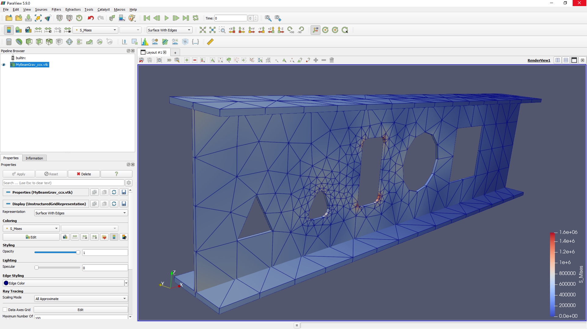
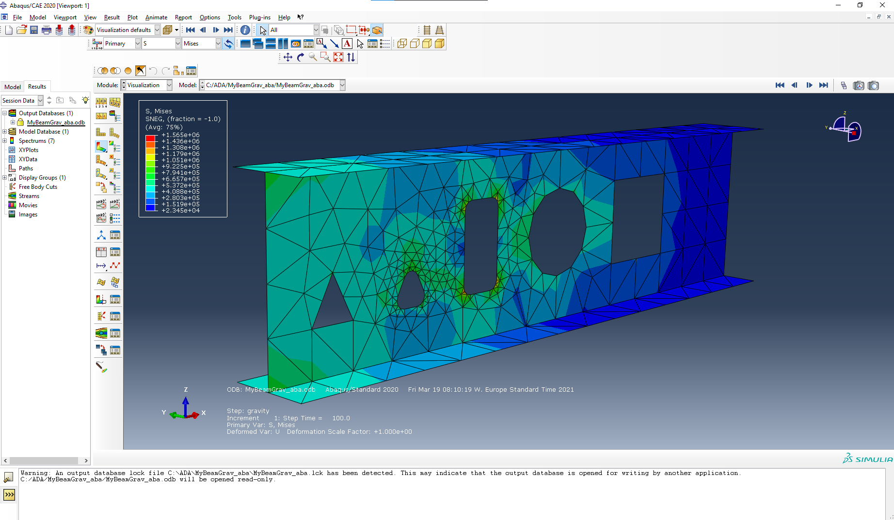
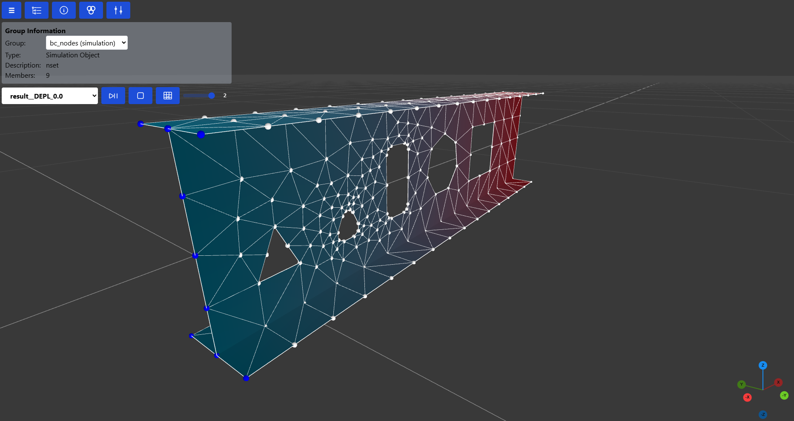

# ADA - Advanced Design & Analysis

[](https://anaconda.org/conda-forge/ada-py)
[](https://anaconda.org/krande/ada-py)
[](https://anaconda.org/conda-forge/ada-py)
[](https://anaconda.org/conda-forge/ada-py)
[](https://pypi.org/project/ada-py/)

A python library for working with structural analysis and design. This library should be considered as experimental.

The recommended way of installing ada-py is with [pixi](https://pixi.sh), in an isolated project
environment:

```
pixi init my-project
cd my-project
pixi add ada-py
```

To only use the `ada` command line tool, install it globally instead:

```
pixi global install ada-py
```

Here are some of the goals with `ada-py`:

* Support reading, writing and modifying FE models and post-processing FE results
* Support open source and commercial FE packages (based on what I use/would like to use regularly)
* Support scriptable FE meshing
* Support reading/writing CAD/BIM formats (STEP/IFC) & mesh formats (GLTF)
* Use a CSG (Constructive Solid Geometry) core primitives library for boolean operations based on the IFC/STEP standards
* Provide the building blocks for advanced parametric and procedural 3d model design and simulation workflows
* The library should always strive for user ergonomics.

## Quick Links

* Feel free to start/join any informal topic related to adapy [here](https://github.com/Krande/adapy/discussions).
* Issues related to adapy can be raised [here](https://github.com/Krande/adapy/issues)
* Docs is located in https://krande.github.io/adapy
* FEA verification documentation [FEA Verification Documentation](https://krande.github.io/adapy/_static/fea-report/index.html).


## Usage
Using the ada-py package 

### Command line

Installing the package also installs a console script:

```
ada --help
```

| Command | What it does |
| --- | --- |
| `ada convert` | Convert a model between CAD/FEM formats. Reads ifc, step, xml, gnx, sat/acis and the FEM decks abaqus (`.inp`), sesam (`.fem`/`.sif`), code_aster (`.med`/`.rmed`); writes ifc, step, gltf/glb, xml, gnx and the FEM decks abaqus, calculix, sesam, usfos, code_aster, opencourant. The extensions pick the formats unless `--from`/`--to` say otherwise, and `--to` is the only way to reach calculix and usfos, which share `.inp` and `.fem` with abaqus and sesam. xml and gnx are one model in two containers -- a `.gnx` is the GeniE workspace, the concept XML zipped with its ACIS body -- so there the extension decides and `--to` cannot override it; `--binary-acis` stores that body as binary SAB (GeniE V9.3+), text being the default. The output path is the one file you name; extra files a format needs land beside it. Local. |
| `ada view` | Open the built-in web viewer on a file, with the `react`, `pygfx` or `trimesh` renderer. Local. |
| `ada build` | Run the entrypoints declared in an `ada_config.toml` and push the artefacts to a viewer (`run`, `upload`, `run-and-upload`). |
| `ada files` | List, download, upload and delete blobs in a viewer scope (`list`, `download`, `upload`, `delete`). |
| `ada audit` | Query, fetch and locally re-run viewer audit conversions (`runs`, `run`, `log`, `perf`, `profile`, `fetch`, `logfile`, `repro`, `wasm-sweep`, `parity`). |
| `ada serve` | Run the REST API or the conversion worker (`api`, `worker`). |

The `build`, `files` and `audit` groups talk to a hosted viewer and read their base URL and token
from the environment (a `.env` in the working directory is picked up too; real environment variables
win). Every command and subcommand takes `--help`, and the full reference is in
[the docs](https://krande.github.io/adapy/cli/).


### Create an IFC file

The following code

```python
from ada import Assembly, Part, Beam

a = Assembly("MyAssembly") / (Part("MyPart") / Beam("MyBeam", (0, 0, 0), (1, 0, 0), "IPE300"))
a.to_ifc("C:/temp/myifc.ifc")
```

creates an Ifc file containing an IfcBeam with the following hierarchy 
    
    MyAssembly (IfSite)
        MyPart (IfcBuildingStorey)
            MyBeam (IfcBeam)



The resulting IfcBeam (and corresponding hierarchy) shown in the figure above is taken from the awesome 
[blender](https://blender.org) plugin [Bonsai](https://bonsaibim.org).

### Convert between FEM formats

Here is an example showing the code for converting a sesam FEM file to abaqus and code aster

_Note! Reading FEM load and step information is not supported, but might be added in the future._

```python
import ada

a = ada.from_fem('path_to_your_sesam_file.FEM')
a.to_fem('name_of_my_analysis_file_deck_directory_abaqus', 'abaqus')
a.to_fem('name_of_my_analysis_file_deck_directory_code_aster', 'code_aster')
```

Current read support is: abaqus, code aster and sesam  
Current write support is: abaqus, code aster and sesam, calculix, usfos and opencourant (explicit shell models)

### Create and execute a FEM analysis in Calculix, Code Aster and Abaqus

This example uses a function `beam_ex1` from [here](src/ada/param_models/fem_models.py) that returns an
Assembly object with a single `Beam` with a few holes in it (to demonstrate a small portion of the steel detailing 
capabilities in ada and IFC) converted to a shell element mesh using a FE mesh recipe `create_beam_mesh` found 
[here](ada/fem/io/mesh/recipes.py). 

```python
from ada.param_models.fem_models import beam_ex1

a = beam_ex1()

a.to_fem("MyCantilever_abaqus", "abaqus", overwrite=True, execute=True, run_ext=True)
a.to_fem("MyCantilever_calculix", "calculix", overwrite=True, execute=True)
a.to_fem("MyCantilever_code_aster", "code_aster", overwrite=True, execute=True)
```

after the code is executed you can look at the results using supported post-processing software or directly
in python using the built-in THREEJS based viewer in a web browser or Jupyter notebook/lab for the FEA results.






## Acknowledgements

This project would never have been possible without the existing open source python and c++ libraries adapy depends on. 


## Project Responsible ##

	Kristoffer H. Andersen
