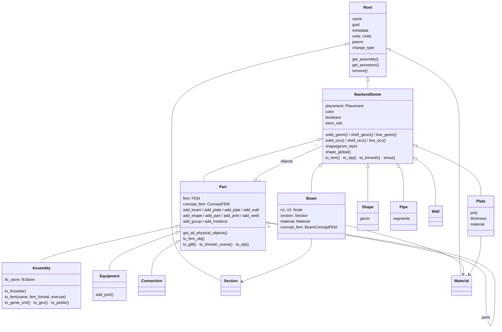
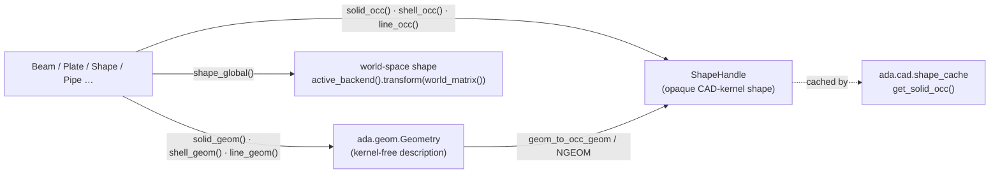

# Core object model

Everything you model in adapy is a tree of `Part`s under one `Assembly`. Each node of the
tree is a `Root`, so it has a name, a guid, metadata, units and a parent. Physical objects
(beams, plates, shapes, pipes, walls) are `BackendGeom`s, which describe their own geometry.

## Class hierarchy



| Area | Classes | Where |
|---|---|---|
| Base | `Root`, `BackendGeom`, `Units` (`M`, `MM`), `GeomRepr` (`SOLID`, `SHELL`, `LINE`) | `ada/base/` |
| Hierarchy | `Assembly`, `Part`, `Equipment` | `ada/api/spatial/` |
| Beams | `Beam`, `BeamTapered`, `BeamSweep`, `BeamRevolve`, `BeamCurved` | `ada/api/beams/` |
| Plates | `Plate`, `PlateCurved` | `ada/api/plates/` |
| Primitives | `Shape`, `PrimBox`, `PrimCyl`, `PrimCone`, `PrimSphere`, `PrimExtrude`, `PrimRevolve`, `PrimSweep`, `BoolHalfSpace`, `ShapeProxy` | `ada/api/primitives/` |
| Piping | `Pipe`, `PipeSegStraight`, `PipeSegElbow` | `ada/api/piping/` |
| Walls | `Wall`, `WallInsert` | `ada/api/walls/` |
| Connections | `Connection`, `JointBase`, `ConnectionSpec`, `MemberCriteria` | `ada/api/connections/` |
| Fasteners | `Weld`, `Bolts` | `ada/api/fasteners.py` |
| Systems | `PipingSystem`, `DuctSystem`, `CableSystem`, … | `ada/api/systems/` |
| Sections | `Section` and subclasses (`SectionI`, `SectionBox`, `SectionTubular`, `SectionPoly`, `SectionGeneral`, …), profile library, string parser (`Section.from_str("IPE300")`) | `ada/sections/` |
| Materials | `Material`, `CarbonSteel`, `Aluminium`, `DnvGl16Mat` | `ada/materials/` |
| Placement | `Placement`, `Transform`, `Rotation`, `Instance`, `EquationOfPlane` | `ada/api/transforms.py` |

## Building a model

There are two ways to put objects into a part: `add_object` / `add_beam` / …, or the `/`
operator, which works like `pathlib`:

```python
import ada

bm = ada.Beam("bm1", (0, 0, 0), (1, 0, 0), "IPE300")
pl = ada.Plate("pl1", [(0, 0), (1, 0), (1, 1), (0, 1)], 0.01)
a = ada.Assembly("MyAssembly") / (ada.Part("MyPart") / (bm, pl))
```

The `Assembly` is the root of the tree. It owns the `IfcStore` used for IFC export and
offers the whole-model exports (`to_ifc`, `to_fem`, `to_genie_xml`, `to_gnx`).

## Geometry on the object

Each physical object answers for its own geometry at two levels:



The `*_geom()` methods return plain data (`ada.geom`), which the IFC writer, NGEOM
serialiser and tessellators consume without a kernel. The `*_occ()` methods build a kernel
shape through the active `ada.cad` backend and are cached by `ada.cad.shape_cache`.
[Geometry & visualisation](geometry_and_visualisation.md) covers this in more detail.

## FEM ownership

Every `Part` owns:

- `part.fem`: an `ada.fem.FEM`, the finite element model of this part (nodes, elements, sets,
  sections, steps, loads, constraints). It is empty until you mesh the part
  (`to_fem_obj()`), read an FE deck into it (`ada.from_fem`) or build it by hand.
- `part.concept_fem`: a `ConceptFEM`, which holds concept-level loads and constraints
  defined on the physical objects rather than on mesh nodes.

See [FEA](fea.md).

## Configuration

`ada.config.Config` is a singleton settings tree. Values come from a config file and are
overridden by `ADA_<SECTION>_<KEY>` environment variables. `update_config_globally` sets the
variable and reloads.

| Section | Notable keys |
|---|---|
| `general` | `point_tol`, `mtol`, `use_experimental_cache`, `guid_cache_enabled` |
| `ifc` | `export_props`, `import_shape_geom` |
| `cad` | `lazy_shape_store`, `shape_store_compress`, `native_ngeom_export` |
| `occ_tess` | `linear_deflection`, `angular_deg` |
| `meshing` | `check_hanging_nodes`, `array_backed` (default on: FEM meshes use `MeshArrays`) |
| `fem_convert_options` | `ecc_to_mpc`, `hinges_to_coupling` |
| `procedures` | `script_dir` |

Other sections: `gxml`, `sat`, `geom`, `fea`, `code_aster`, `websockets`.
