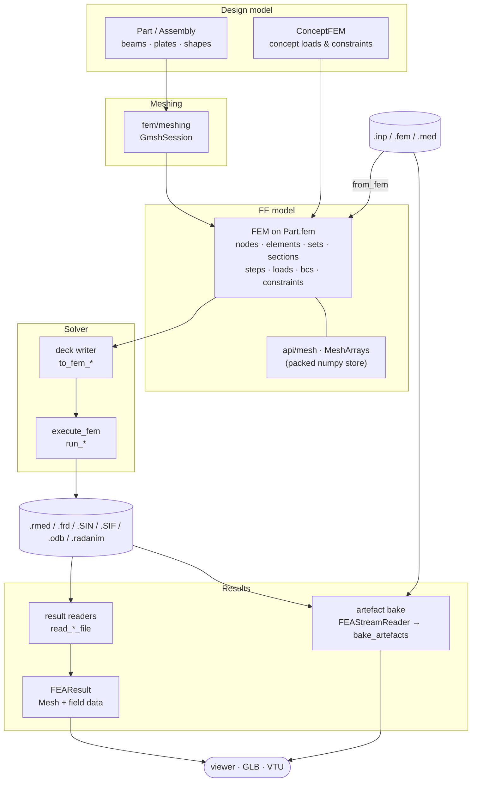
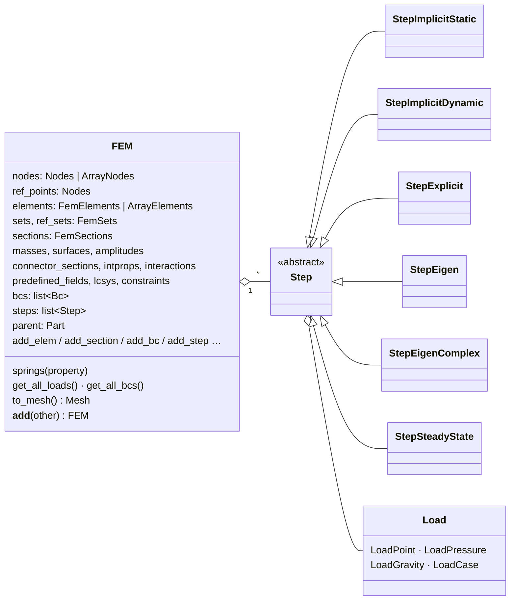
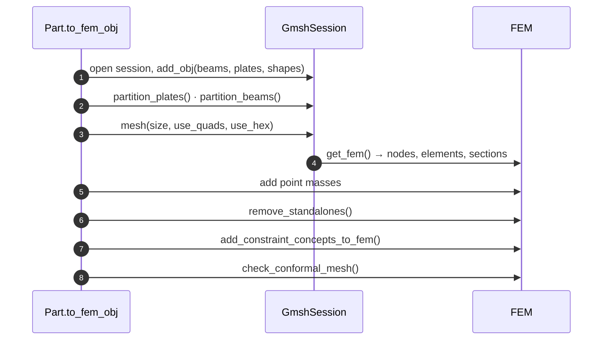
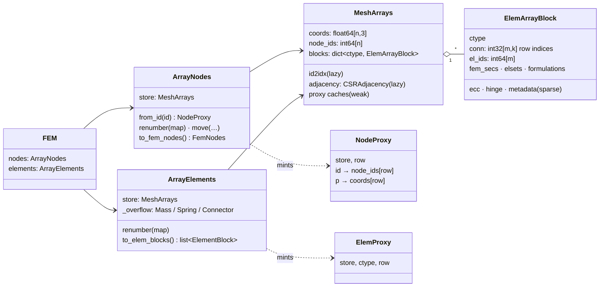
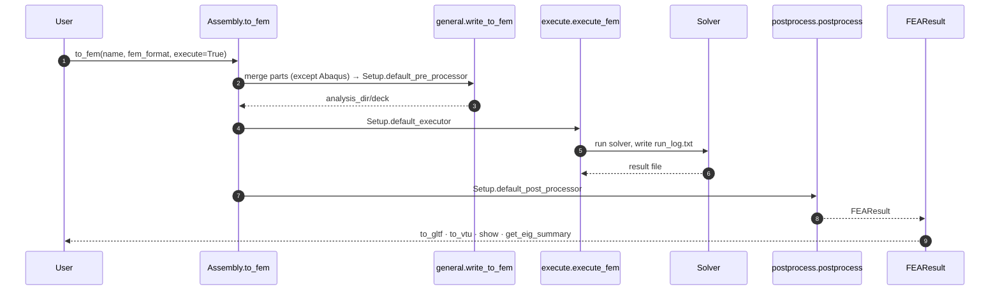
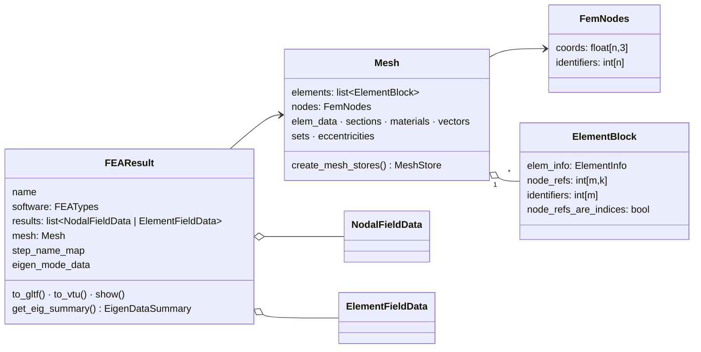
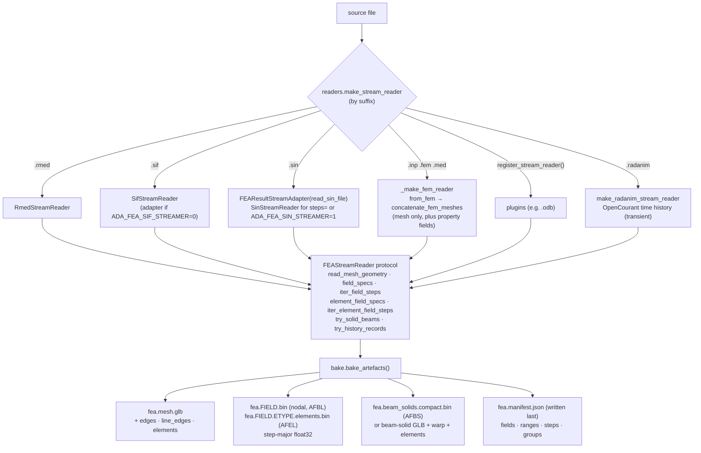
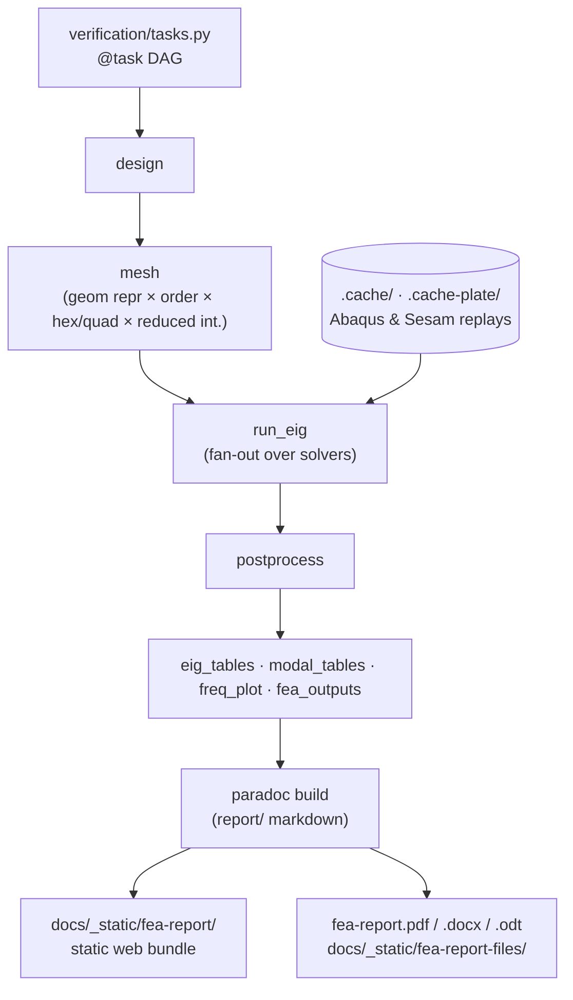

# FEA

adapy covers the whole finite element loop: model → mesh → solver deck → run → results →
post-processing and visualisation. This page follows that loop through the code.

## The FE model (`ada.fem`)

`ada.fem.base.FEM` is a dataclass owned by every `Part` (`part.fem`):

| Module | Contents |
|---|---|
| `fem/base.py` | `FEM` |
| `fem/containers.py` | `FemElements`, `FemSets`, `FemSections` (object containers); nodes live in `api/containers/nodes.py` (`Nodes`) |
| `fem/elements.py`, `fem/shapes/` | `Elem`, `Mass`, `Spring`, `Connector`; `LineShapes`, `ShellShapes`, `SolidShapes`, `ConnectorTypes`, `ShapeResolver`, `ElemShape`, node ordering |
| `fem/formulations/` | `Formulation`, `BeamTheory` |
| `fem/steps.py` | The step types above, `StepSolverOptions` |
| `fem/loads/` | `Load`, `LoadPressure`, `LoadGravity`, `LoadPoint`, `LoadCase` |
| `fem/concept/` | `ConceptFEM` (on `Part.concept_fem`), `BeamConceptFEM` (`Beam.concept_fem.fix_end()` …), constraint concepts (point, beam end, curve, rigid link) and load concepts (point, line, surface, acceleration field, load cases, combinations) |
| `fem/meshing/` | `GmshSession`, partitioning strategies, `multisession_gmsh_tasker` |
| `fem/concat.py` | `concatenate_fem_meshes`, `concatenate_fem_to_single_part` |
| `fem/conformality.py` | `check_conformal_mesh` |

Concept-level constraints are converted to FE constraints by
`fem/concept/to_fem.add_constraint_concepts_to_fem`. Concept loads are carried to and from
Genie XML (`cadit/gxml`).

### Meshing a design model

`Part.to_fem_obj()` drives gmsh:

## The array-backed mesh store (`ada.api.mesh`)

With `Config().meshing_array_backed` on (the default; opt out with
`ADA_MESHING_ARRAY_BACKED=false`), a `FEM`'s nodes and elements are thin facades over one
packed numpy store, `MeshArrays`. `Node` / `Elem` objects are minted on demand as lazy
proxies.

- **Connectivity holds row indices, not node ids.** Renumbering nodes only rewrites
  `node_ids`. Handing the mesh to the results side (`FEM.to_mesh()`) is zero-copy:
  `to_elem_blocks()` passes `conn` and `el_ids` through as
  `ElementBlock(..., node_refs_are_indices=True)`.
- **Node→element adjacency** is a CSR incidence (`CSRAdjacency`), built lazily, instead of
  per-node reference lists.
- **The Sesam, Abaqus and Code_Aster readers** fill a `MeshArrays` directly from the deck
  (Sesam can stream the file). Other FEMs are converted with `to_array_backed(fem)`.
  `GmshSession.get_fem()` still produces object containers, which
  `fem/formats/utils.convert_part_objects` converts.
- **`fem/concat.py`** merges multi-part models at store level, offsetting ids and re-keying
  sets, sections, boundary conditions and masses.

## Solver integration

`ada.from_fem_res(path)` starts from an existing result file at the `postprocess` step.
[Interoperability](interop.md#finite-element-formats) lists each solver's functions. Abaqus
runs can wait for FlexNet licence tokens (`abaqus/licensing.abaqus_license_slot`, opt-in via
`ADA_ABAQUS_LICENSE_WAIT_S`).

## Results (`ada.fem.results`)

Every result reader produces the same read-only snapshot:

| Module | Contents |
|---|---|
| `common.py` | `FEAResult`, `Mesh`, `FemNodes`, `ElementBlock`, `ElementInfo`, `MeshStore` |
| `field_data.py` | `NodalFieldData`, `ElementFieldData`, `FieldPosition`, line-section integration points |
| `eigenvalue.py` | `EigenDataSummary`, `EigenMode` |
| `sqlite_store.py` | `SQLiteFEAStore` |
| `case_result.py`, `line_sections.py` | Cached per-case results; beam line-section tables |
| `docs.py` | FEA bundles for the verification report (`bake_fea_bundles`, `collect_fea_bundles`, `restore_fea_bundles`) |

Result readers use the ids from the source file. `node_refs_are_indices=False` (the
default) means `node_refs` holds node ids, which consumers map to rows. Only
`FEM.to_mesh()` produces row-index blocks.

## Viewer bake

Large results are not loaded into the browser as one GLB. The **bake**
(`fem/results/artefacts`) streams a result source into a set of files that the viewer fetches
piece by piece:

- Fields are written **one step at a time** (`FieldBlobWriter`, `ElementFieldBlobWriter`), so
  peak memory does not grow with the number of steps. Each blob has a fixed JSON header and
  then a contiguous `[steps × entities × components]` array that the viewer range-fetches
  per step.
- `FEAResultStreamAdapter` makes any eager reader that returns a `FEAResult` fit the protocol.
- `beam_solids.py` / `beam_compact.py` extrude beam elements to solids with their real
  section profiles. The compact format stores one instance per beam and lets the viewer
  expand them.
- Extras: `mode_normalization` (mode-shape scale factors), `step_subset`
  (`restrict_to_steps`), `history` (time-history records), `posters` (offscreen PNG posters
  via pygfx, `bake_with_posters`).
- On the platform, the `fea_artefacts` job runs `bake_fea_artefacts_from_source` and writes to
  `_derived/<source>.fea/`. The REST routes in `routes/fea.py` serve the artefacts and the
  manifest (see [Viewer platform](platform.md)).

## Verification report

`verification/` is a [paradoc](https://github.com/Krande/paradoc) project that builds the
[FEA verification report](../fea/verification.md):

Code_Aster and CalculiX run on every build. Abaqus and Sesam need licences, so their results
replay from committed caches (`_CACHE_ONLY_SOLVERS`). `fea_outputs` bakes the mode-shape
artefact bundles that the report's interactive 3D views load.
