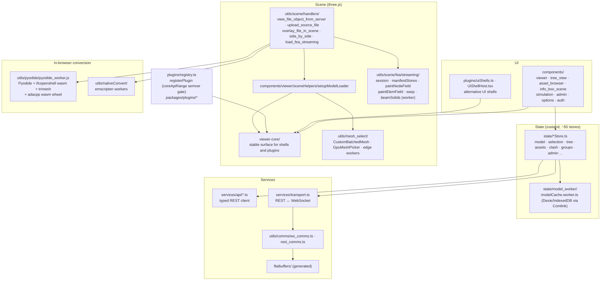
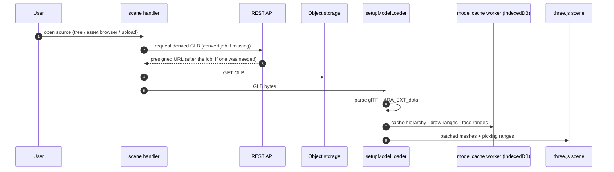
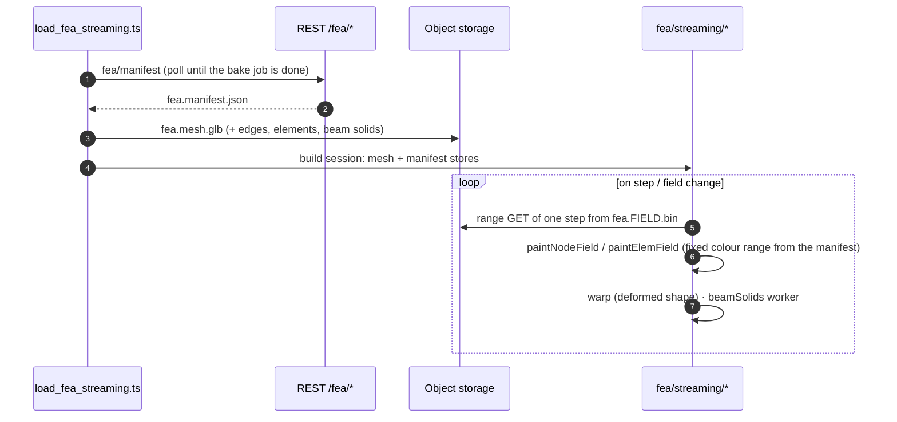

# Frontend

`src/frontend` is the viewer: a React 19 + three.js single-page app built with Vite. The same
code ships in four forms:

| Form | Build | Where it runs |
|---|---|---|
| Hosted SPA | `npm run build:serve` (inside `Dockerfile.viewer`) | Served by the REST API, talks to `/api/*` |
| Local viewer | `npm run build` → `embed-script.cjs` inlines JS + CSS into one HTML → `ada/visit/rendering/resources/index.zip` | `obj.show()` from any Python script: served by `ada.comms.web.serve` and fed by the local `wsock` server, in a browser tab |
| Inline viewer | the same `index.zip` bundle | `obj.show()` in Jupyter: an `<iframe srcdoc>` in the cell output with the GLB inlined (`window.B64GLTF`) |
| Embeddable viewer | `vite.config.embed.ts` | `mountViewer(element, {modelBytes, camera, showControls})` → `{dispose()}`; several per page (`embed/viewerInstances.ts`), used by the paradoc FEA report |

## Structure

Main libraries: three.js, camera-controls, zustand, Comlink, Dexie, flatbuffers,
meshoptimizer, react-arborist (trees) and `@xyflow/react` (node editor). Styling uses
Tailwind 4. Plugins live in npm workspaces under `packages/plugins/*`, and
`npm run gen:plugins` generates `registry.generated.ts`.

## Loading a model

`ADA_EXT_data` provides the object hierarchy and per-object draw ranges, so one merged mesh
can still be picked, hidden and coloured object by object (`utils/mesh_select`).

## Loading FEA results

Because each field blob is step-major with a fixed header, one step is one HTTP range
request. Colour ranges come pre-computed from the manifest, so the legend stays fixed while
scrubbing through steps.

A `transient` result (a time history, for example an OpenCourant `.radanim`) opens on its last
frame. The step slider becomes a timeline, and Play steps through it at true time scale
(`utils/scene/fea/timeHistory.ts`). Step loads run one at a time, and the latest request wins.
Any result can be exported as a video (`utils/scene/fea/animationExport/`): MP4 through
WebCodecs and mediabunny, or GIF through gifenc. You choose resolution, aspect, frame rate, and
whether to include the legend and orientation gizmo. The encoders load only when used.

## In-browser conversion

Without a worker (or for local files), `pyodide_converter.ts` lazily starts
`pyodide_worker.js`: Pyodide with ifcopenshell (wasm) and trimesh for IFC → GLB, and the
adacpp wasm wheel for STEP → GLB. The worker is recycled above ~1.4 GB of heap. The browser
can also run the FEA bake and upload the artefacts through the REST API.
