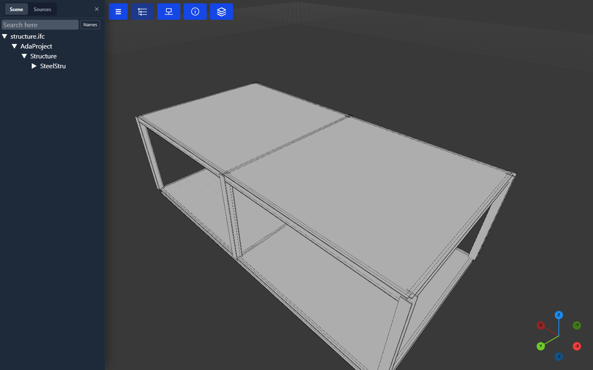
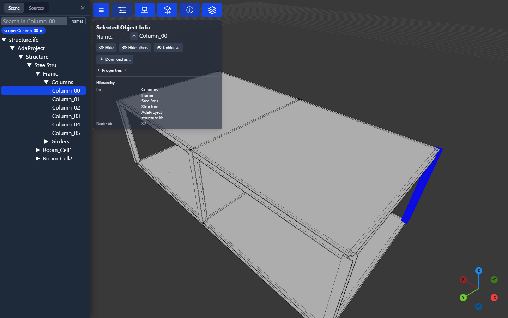
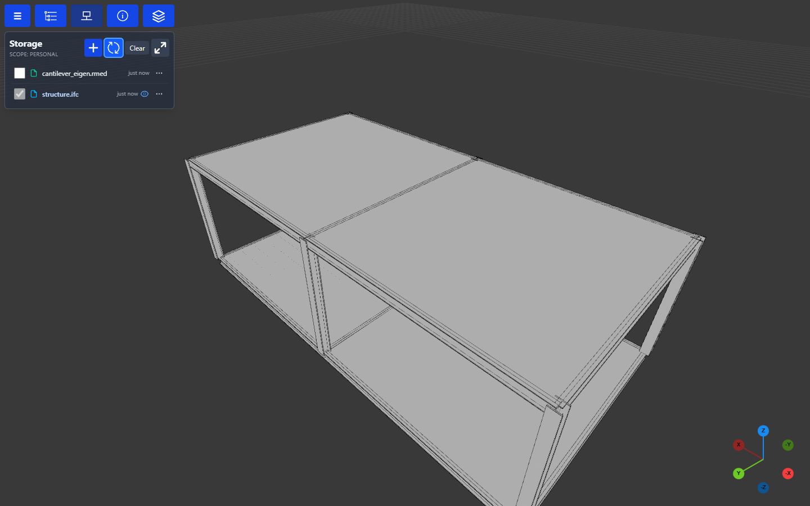
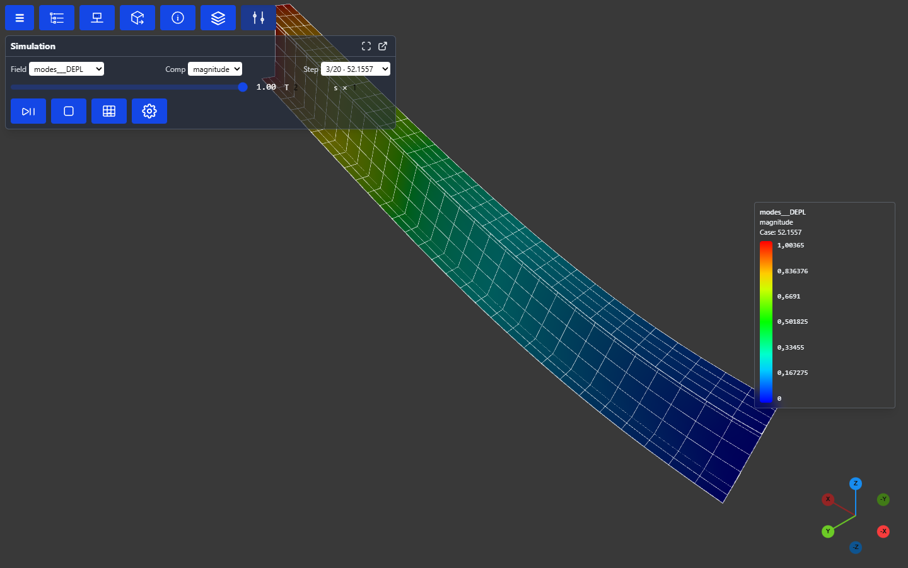
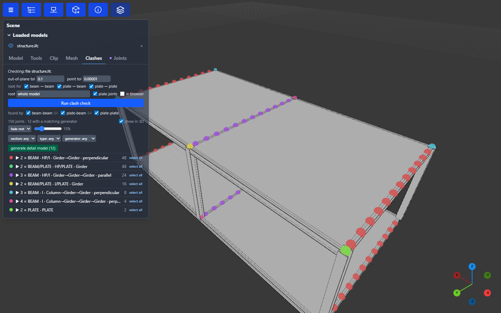

# Ada Studio

adapy is a library first. Everything on this page (reading and converting models, meshing,
clash and joint checks, baking FE results) is adapy code, and the same functions are
yours to call from a Python script, a Jupyter notebook or your own application.

Ada Studio is the web application built on top of it, with adapy as its engine. You can open
CAD, BIM and FE models in the browser, look through them, run checks on them and walk
through FE results, with no installation on the client. A server stores your files and its
workers run adapy to convert, bake and check them.

Its viewer is not limited to the hosted application. Calling `.show()` on a model, a part or
an FE result opens the same viewer from any script: in a browser tab served by a local
viewer server, or inline when the call runs in Jupyter.

The screenshots on this page are generated, not taken by hand: each one is a **user story**
in [`scripts/ui_stories.py`](https://github.com/Krande/adapy/blob/main/scripts/ui_stories.py)
that drives the real application (see [Regenerating the screenshots](#regenerating-the-screenshots)).

## Open a model

A model in your storage opens in the 3D view together with its object tree. Here it is an IFC
file of the [topology engine's](topology_engine.md) demo structure: columns, girders,
stiffeners and decks, organised the way the model's parts are.



## Select and inspect

Click a member in the tree or in the 3D view to select it. **Selected Object Info** shows its
name and where it sits in the hierarchy. **Properties** reads its attributes from the source
file on demand, so the model you load stays lean. From the panel you can hide the member or
everything else, and download the selection as its own file.



## Your files

**Storage** lists the files in the current scope: your personal one, a project, or the
shared scope. Tick a file to load it, and the eye icon marks what is in the scene. A source
such as an IFC, STEP or Genie XML file is converted to a viewable model the first time you
open it. **+** uploads files (or drop them on the panel), creates folders, and starts a new
procedural model, from scratch, from a template or from Excel. The **⋯** on each row holds
that file's own actions.



## FE results

Result files open in the streaming FE viewer: a Code_Aster `.rmed` here, and Sesam
`.SIN`/`.SIF`, OpenCourant `.radanim` and FE meshes the same way. Pick the **field**, the
**component** and the **step** (for an eigenvalue analysis, the mode and its frequency), scale
the deformation, or let the mode oscillate. A time history, such as an
[OpenCourant](fea/fea_software.md#opencourant) explicit run, opens on its last frame, and the
step slider becomes a timeline that **Play** steps through at true time scale. Either kind can
be exported as an MP4 or GIF animation. Each step is fetched on its own, so a result with
hundreds of steps opens as fast as one with a single step.
[FEA → Viewer bake](architecture/fea.md#viewer-bake) explains how.



## Clash and joint check

**Scene → Clashes → Run clash check** finds every place members meet: beam to beam, plate to
beam and plate to plate. It groups the joints by type (member kinds, section families, column or
girder, the angle between them) and marks them in 3D. Filter the groups, isolate one, and see
which [connection rules](architecture/platform.md#clash-and-joints-adaclash) apply. Here, 12
joints match the built-in girder-gusset rule, and **generate detail model** builds those details.



## What else is in it

- **Assets and sources:** project trees that providers publish into a scope, with a
  **Sources** tab next to the scene tree, attributes per object, and geometry roll-ups.
- **Groups:** named selections that are saved with the scope and shared with everyone who can
  read it.
- **Procedural models:** cell-model documents compiled into structures, equipment and routed
  systems by the [topology engine](topology_engine.md), with equipment and system catalogs.
- **Plugins:** UI shells, panels and URL handlers on the frontend side, and plugin backends,
  artefact contributors and job kinds on the worker side.
- **Administration:** users, projects, storage, workers, scheduled audits of conversions,
  and the issue bot that turns failures into tracked issues.

[Viewer platform](architecture/platform.md) and [Frontend](architecture/frontend.md) describe
how it is built.

## Run it yourself

The quickest local setup is the development stack: NATS, the API and one worker, with local
storage and no login:

```bash
pixi run up            # docker compose: deploy/docker-compose.dev.yml
```

Without Docker, run the API straight from the `viewer-api` environment and serve the built
frontend from it:

```bash
pixi run -e frontend wbuild-serve                  # builds src/frontend/dist
ADA_VIEWER_STATIC_PATH=src/frontend/dist \
ADA_VIEWER_LOCAL_PATH=./viewer-data \
pixi run -e viewer-api viewer-api                  # http://localhost:8080
```

Without a job queue (`ADA_VIEWER_NATS_URL` unset) the API runs the clash check, asset builds
and exports in-process, but cannot convert files. Start a worker
(`pixi run -e viewer-api viewer-worker`, with NATS) for conversions and FE bakes.

## Regenerating the screenshots

```bash
pixi run -e frontend wbuild-serve                   # once: the SPA the server serves
pixi run -e tests ui-stories                        # every story, into docs/screenshots/ada-studio/
pixi run -e tests ui-stories --list
pixi run -e tests ui-stories --story fea-modes      # just one; repeatable
pixi run -e tests ui-stories --theme light          # <story>-light.png
```

The script starts a throwaway Ada Studio of its own: local storage under `.pixi/ui-stories/`,
wiped on every run, with no login, no database and no job queue. It seeds a model and an FE
result, converting and baking them in-process with the same code a worker runs. A story is a
function decorated with `@story("name", "summary")`: it opens one screen in the state a user
would see it, and waits for it to settle. Add a story, then embed
`../screenshots/ada-studio/<name>.png` where this page describes it.
