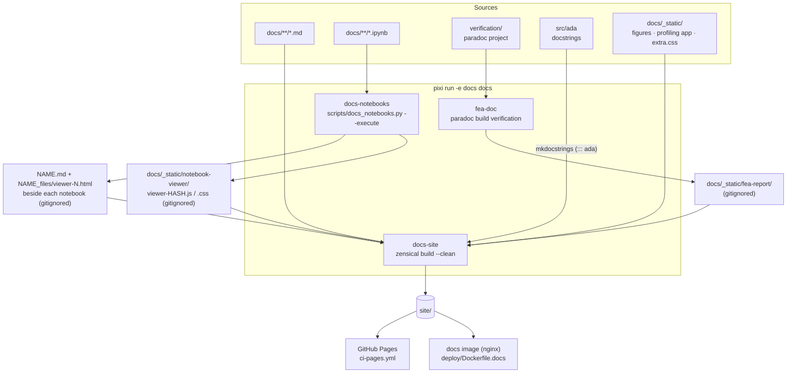
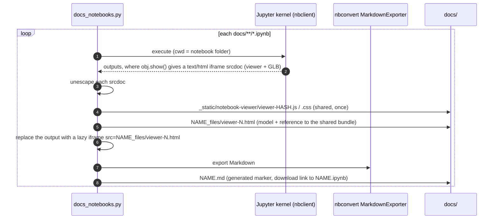

# Docs pipeline

This site is built with [Zensical](https://zensical.org), the static site generator from
the Material for MkDocs team. It is configured by `zensical.toml` at the repository root.
The pages are Markdown in `docs/`.



## Tasks

| Task (`pixi run -e docs …`) | Does |
|---|---|
| `docs` | Everything: `fea-doc`, then `docs-site`. |
| `docs-site` | `docs-notebooks`, then `zensical build --clean` into `site/`. Reuses whatever `docs/_static/fea-report/` already holds. |
| `docs-notebooks` | Executes and converts the notebooks (below). |
| `docs-serve` | `zensical serve`: live-reloading preview on <http://localhost:8000>. Run `docs-notebooks` once first. |
| `serve` | Builds everything, then serves `site/` with `scripts/docs_serve.py` on :8080. |
| `fea-doc`, `fea-doc-cached`, `fea-doc-{docx,odt,pdf}` | The FEA verification report and its downloadable files. |

## Notebooks

Zensical runs no MkDocs plugins, so there is no nbsphinx or mkdocs-jupyter step.
`scripts/docs_notebooks.py` fills the gap:



- **The 3D viewers stay fully interactive.** A `.show()` output is plain HTML, not an
  ipywidget, so it needs no kernel or widget state after the build.
- **Pages stay light.** Each viewer is a separate, lazily loaded page of a few KB plus the
  model. The ~3 MB viewer app is one content-hashed file shared by all of them and cached
  by the browser.
- **The source notebook is published next to its page** and linked for download.
- A cell that raises fails the build. `--no-execute` converts stored outputs only, and
  `--clean` removes everything the script generated.
- **3D figures on ordinary pages** use the same viewer. `FIGURES` in the script maps a name to
  `script.py:function`, a function that returns a model. A full run renders it to
  `_static/viewer-figures/<name>.html`, and the page embeds it with
  `<iframe class="ada-viewer" src="../_static/viewer-figures/<name>.html" loading="lazy">`.
  The procedural modelling page does this with `examples/penetration_detail.py:figure`.
  Its code block is included from the same file
  (`--8<-- "examples/penetration_detail.py:model"`), so the figure always shows the code above it.

## Configuration notes

- `use_directory_urls = false` keeps the Sphinx-era URLs (`documents/cli.html`,
  `_static/fea-report/index.html`) working for existing links.
- Mermaid diagrams are `pymdownx.superfences` custom fences: write a ```` ```mermaid ````
  block. GitHub renders the same blocks when you read the Markdown in the repository.

## Diagrams

The fence is emitted as `<div class="ada-diagram">`, not the theme's `mermaid` class, and
rendered by `docs/_static/diagrams.js`. The theme's own renderer draws into a closed shadow
root, which leaves no way to make a diagram interactive. The script adds:

| Feature | How it works |
|---|---|
| Enlarge | An **Enlarge** button on hover, or a click on empty diagram space, opens a full-screen view: wheel or pinch to zoom, drag to pan, **+ / − / Fit**, Esc to close. |
| Trace connections | Hovering a box in a flowchart or class diagram dims everything except that box, its edges and its direct neighbours. Clicking a box pins the trace (useful on touch screens); clicking empty space releases it. |
| Links and tooltips | A `click NODE href "url" "tooltip"` line makes the box a link (underlined) with a native tooltip. Architecture diagrams link boxes to the page that covers them or to the code on GitHub. |
| Layout | Flowcharts use the ELK layout engine (`@mermaid-js/layout-elk`), which handles nested subgraphs much better than the default dagre. If ELK cannot load, dagre is used. |
| Theme | Diagrams re-render when the light/dark palette is switched. |

When you add a diagram:

- Give boxes short ids (`FEM`, `REG`). Tracing parses edge ids of the form `L_SRC_DST_n`, and
  ids containing `_` still work.
- Add `click` lines for boxes that correspond to a module or a page. Use relative `.html` links
  for pages and `https://github.com/Krande/adapy/blob|tree/main/...` for code.
- Keep labels to two or three short lines. Detail belongs in the table under the diagram.
- The API reference (`documents/code.md`) uses mkdocstrings with the Python handler
  (`paths = ["src"]`, Sphinx-style docstrings).
