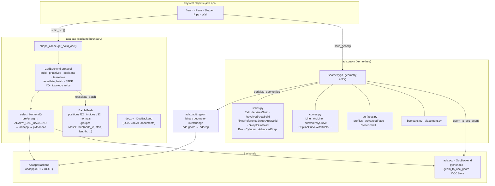
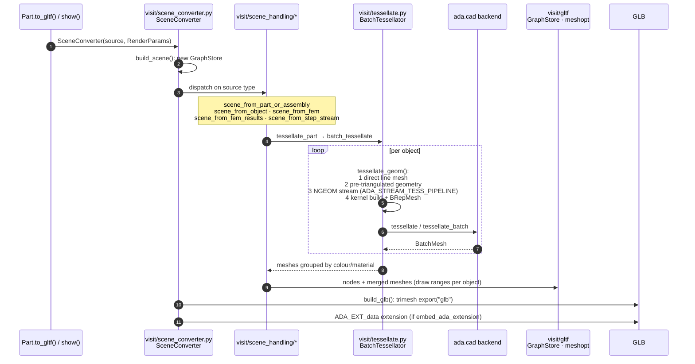

# Geometry & visualisation

adapy separates *describing* geometry from *building* it:

- **`ada.geom`** is a kernel-free, IFC-like vocabulary of solids, curves and surfaces. Every
  physical object can produce it without a CAD kernel.
- **`ada.cad`** is the boundary to a CAD kernel. It defines the `CadBackend` protocol and
  selects an implementation at runtime: **adacpp** (native C++ on OpenCascade, preferred) or
  **pythonocc** (`ada.occ`).
- **`ada.visit`** turns models, FE meshes and FE results into glTF/GLB scenes for the viewers.

## Layers

`ShapeHandle` is opaque: callers never touch kernel types directly. `to_occ_shape()` is the
documented way out to a raw pythonocc shape for code that really needs one. adapy itself
does not depend on adacpp. When it is installed, the IFC/STEP readers and writers, NGEOM
export, mesh optimisation, joint detection and the FEA beam-solid tessellation use it.

## From model to GLB

Objects that share a material are merged into one glTF mesh, and per-object *draw ranges*
are kept so the viewer can still pick, hide and colour single objects. The `ADA_EXT_data`
extension (schemas in `src/gltf_extension_schema/`, pydantic models in `ada.extension`)
carries the design and simulation metadata next to the geometry: object hierarchy, draw
ranges, FEM concepts and simulation results.

For FE meshes and results, `scene_from_fem` / `scene_from_fem_results` build the scene from
`ada.fem.results.common.Mesh` (`Mesh.create_mesh_stores()` → `MergedMesh` points, lines,
faces and optional solid beams) instead of tessellating B-rep.

## Big-file paths

Some sources never become an `Assembly`:

| Path | What it does |
|---|---|
| `cadit/step/native_step_to_glb.py`, `step2glb_capi` | STEP → GLB inside adacpp. |
| `cadit/step/stream_to_glb.py` + `glb_spill.GlbSpillStore` | STEP streamed through OCC; meshes spill to disk and the GLB is written from the spill (`write_glb_from_spill`), so memory stays bounded. |
| `cadit/ifc/native_ifc_to_glb.py` | IFC → GLB via adacpp. |
| `visit/scene_handling/scene_from_step_stream.py` | Scene from a streamed STEP. |
| `fem/results/artefacts` | FEA results → mesh GLB + per-step field blobs (see [FEA](fea.md#viewer-bake)). |

## Renderers

| Renderer | Where | Used for |
|---|---|---|
| `RendererReact` | `visit/rendering/renderer_react.py` | `obj.show()` in Jupyter: the viewer bundle (`resources/index.zip`) with the GLB inlined, in an `<iframe srcdoc>`. |
| `WebSocketRenderer` | `visit/rendering/renderer_widget.py` | The viewer connected to a running `wsock` server. |
| pygfx offscreen | `visit/rendering/render_pygfx.py`, `fea_offscreen.py` | Headless PNG posters (for example the FEA verification report's mode shapes). |
| `renderer_manager` | `visit/renderer_manager.py` | Chooses between notebook embedding and an external viewer. |
