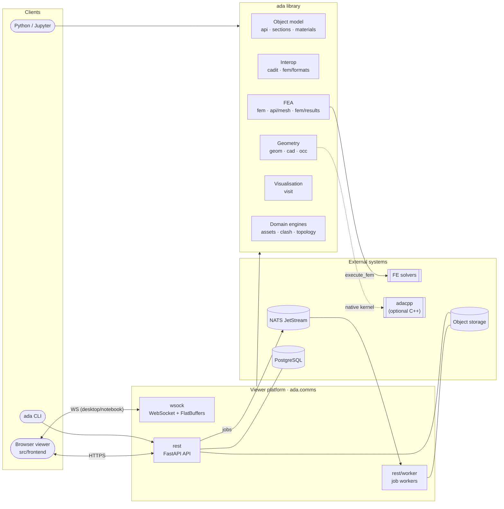
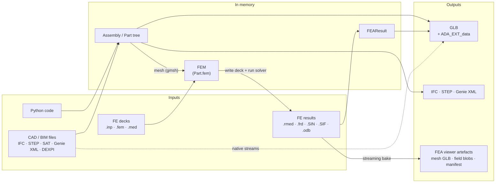

# Architecture overview

adapy is two things that share a code base:

1. **`ada`**, a Python library for modelling structures and plants, converting them
   between CAD/BIM and finite element (FE) formats, running solvers and post-processing
   their results.
2. **The ada viewer platform**, built on that library: a browser viewer (`src/frontend`),
   a FastAPI REST service, and a pool of NATS-driven workers that convert, bake and check
   models stored in object storage.

These pages describe how the pieces fit together. They name real modules and classes,
so you can go from a diagram straight to the code.

| Page | Covers |
|---|---|
| [Core object model](core_model.md) | `Assembly` / `Part` / physical objects, base classes, sections, materials, placement, `Config` |
| [Geometry & visualisation](geometry_and_visualisation.md) | `ada.geom`, the `ada.cad` backend layer (adacpp / pythonocc), tessellation, the GLB scene pipeline |
| [Interoperability](interop.md) | `ada.factories`, `ada.cadit` (IFC, STEP, SAT, Genie XML, DEXPI, …), NGEOM, FE deck formats |
| [FEA](fea.md) | `FEM`, concepts, meshing, the array-backed mesh store, solver integration, results, the viewer bake, verification |
| [Viewer platform](platform.md) | WebSocket and REST servers, jobs and workers, storage, database, auth, assets, clash, plugins, deployment |
| [Frontend](frontend.md) | The React/three.js viewer, model and FEA loading, in-browser conversion, the embeddable and notebook viewers |
| [Docs pipeline](docs_pipeline.md) | How this site is built: Zensical, notebook conversion, the FEA verification report |

## System context

Inside the library, `factories.py` (`from_ifc`, `from_step`, `from_fem`, `from_fem_res`, …)
is the front door. Interop builds the object model. The object model owns geometry and
FE models. Everything ends in `visit` (GLB scenes) or in files written by interop.

## Package map

| Package | Responsibility |
|---|---|
| `ada.api` | The user-facing object model: `spatial` (`Assembly`, `Part`), `beams`, `plates`, `primitives`, `piping`, `walls`, `connections`, `systems`, `fasteners`, plus `transforms`, `boolean`, `groups`, `mass`. Also `api/mesh`, the array-backed FEM mesh store. |
| `ada.base` | `Root`, `BackendGeom`, `Units`, `GeomRepr`, change tracking, and the adacpp switch. |
| `ada.sections`, `ada.materials` | `Section` (I, box, tubular, angular, poly, general, …) with a profile library and string parsing; `Material` with metal models (`CarbonSteel`, `Aluminium`, `DnvGl16Mat`). |
| `ada.geom` | Kernel-free geometry descriptors (IFC-like): solids, curves, surfaces, booleans, placements, B-rep. |
| `ada.cad` | Backend-neutral CAD layer: the `CadBackend` protocol, backend selection (adacpp → pythonocc), `BatchMesh`, and the shape cache. |
| `ada.occ` | The pythonocc backend: `OccBackend`, `geom_to_occ_geom`, `OCCStore`, STEP store/writer, tessellation. |
| `ada.cadit` | CAD/BIM interop: `ifc`, `step`, `sat`, `gxml` (Genie XML), `dexpi`, `e3d` (AVEVA macros), `ngeom` (native interchange). |
| `ada.fem` | The FE model (`FEM`, elements, sets, sections, steps, loads, constraints), concept-level FEM, gmsh meshing, shapes, solver `formats`, and `results` (including the viewer artefact bake). |
| `ada.visit` | Visualisation: `SceneConverter` → GLB, tessellation, glTF graph/optimisation, offscreen and notebook renderers. |
| `ada.extension` | Pydantic models generated from `src/gltf_extension_schema` for the `ADA_EXT_data` glTF extension. |
| `ada.comms` | Servers: `wsock` (FlatBuffers WebSocket), `rest` (FastAPI app, worker, jobs, storage, DB), `fb` (generated FlatBuffers bindings), `msg_handling`. |
| `ada.assets` | A tree-shaped asset store fed by providers (publish, index, geometry roll-up, hierarchy projection). |
| `ada.clash` | Joint identification, typing and grouping between members, possibly across published assets. |
| `ada.topology`, `ada.topo_model` | A domain-free cell-graph toolkit (grid, blueprint, routing, design rules) and a demo engine on top of it. |
| `ada.procedural_modelling`, `ada.param_models` | Decorator-registered procedures exposed as CLIs and to the viewer; example parametric models. |
| `ada.plugins` | The Python plugin registry (backends, artefact contributors, external model providers), the twin of the frontend plugin registry. |
| `ada.build` | `ada-build` orchestration: run `publish()` outputs, record git provenance, upload. |
| `ada.core`, `ada.calc`, `ada.drawings`, `ada.serialize` | Utilities (vectors, guids, curves, file system), beam hand calculations, SVG drawings, xlsx serialisation. |
| `ada.config` | `Config`: a singleton settings tree (file < `ADA_*` environment variables). |

Outside `src/ada`:

| Path | What |
|---|---|
| `src/ada_cli` | The `ada` command: `convert`, `view`, `build`, `files`, `audit`, `serve api / worker`. |
| `src/frontend` | The viewer (React + three.js), also bundled as the notebook viewer and an embeddable `mountViewer`. |
| `src/flatbuffers` | `.fbs` schemas and the code generators for the Python and TypeScript bindings. |
| `src/gltf_extension_schema` | JSON schemas of the `ADA_EXT_data` glTF extension. |
| `verification/` | The FEA verification report (paradoc project) published with these docs. |
| `deploy/` | Dockerfiles, docker compose, the Helm chart. |

## Main data flows

| From | To | Through |
|---|---|---|
| CAD/BIM files | `Assembly` | `ada.from_ifc`, `from_step`, `from_genie_xml`, `from_dexpi`, … |
| `Assembly` | CAD/BIM files | `to_ifc`, `to_stp`, `to_genie_xml`, `to_gnx` |
| `Assembly` | GLB | `to_gltf` / `show` (`SceneConverter`) |
| STEP / IFC | GLB, without an object tree | `native_step_to_glb`, `stream_step_to_glb`, `native_ifc_to_glb` |
| `Part` | `FEM` | `to_fem_obj` (gmsh); FE decks via `ada.from_fem` |
| `FEM` | results | `Assembly.to_fem(..., execute=True)`: write the deck, run the solver, post-process |
| Result files | `FEAResult` | `ada.from_fem_res`; then `to_gltf`, `to_vtu`, `show` |
| Result files, FE decks | viewer artefacts | `bake_fea_artefacts_from_source` (streaming) |

Two principles run through all of it:

- **Kernel-free first.** Objects describe their geometry as `ada.geom` data (`solid_geom()`,
  `shell_geom()`, `line_geom()`). A CAD kernel (adacpp or pythonocc) is only involved when
  something has to be built, tessellated or written as B-rep, and it is reached through the
  `ada.cad` backend protocol.
- **Stream big things.** STEP and IFC can go straight to GLB without building the object tree
  (`native_step_to_glb`, `native_ifc_to_glb`, `stream_step_to_glb`), FEM decks are read into
  packed arrays (`MeshArrays`), and FEA results are baked one step at a time
  (`FEAStreamReader`). The aim is memory that stays flat however big the model is.
