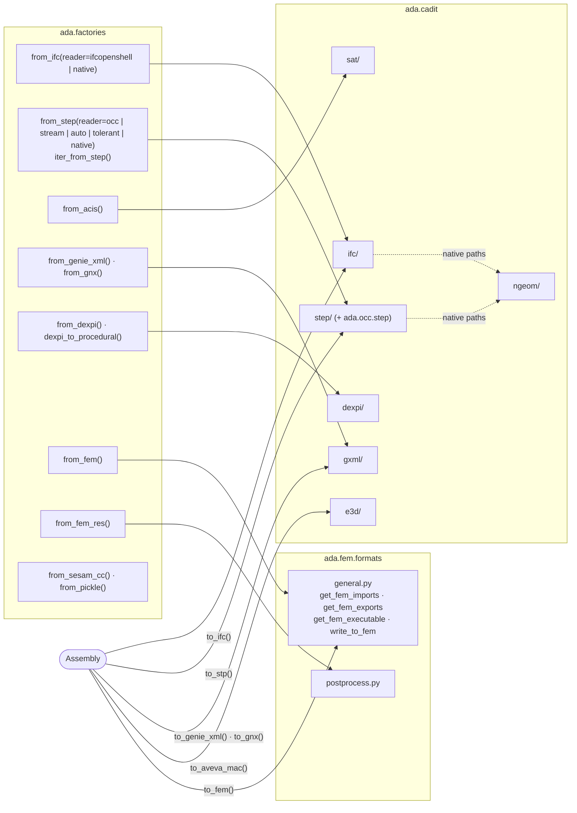
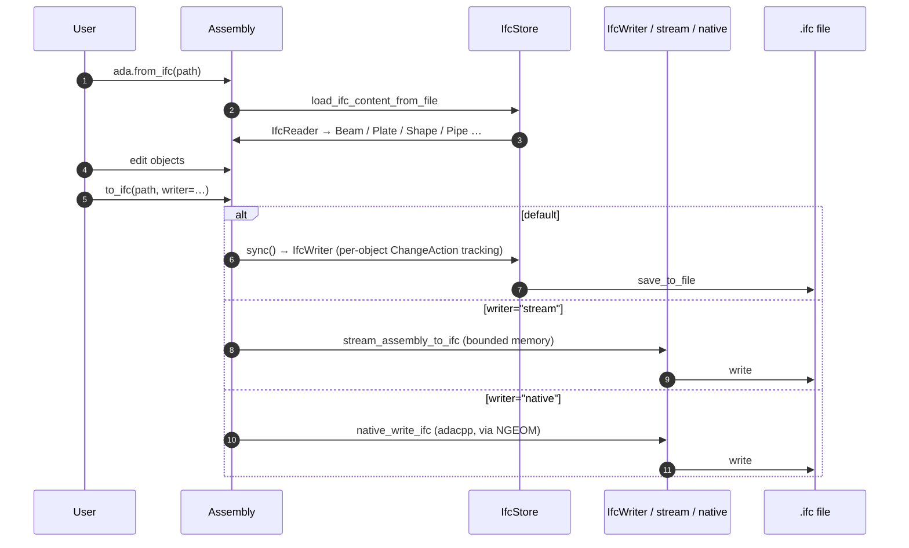

# Interoperability

Reading and writing other formats is split in two:

- **`ada.cadit`** handles CAD/BIM formats: IFC, STEP, SAT, Genie XML/GNX, DEXPI and AVEVA E3D
  macros, plus NGEOM, the native interchange with adacpp.
- **`ada.fem.formats`** handles finite element formats: solver input decks, solver execution
  and results.

Both are reached through the functions in `ada/factories.py` and the export methods on
`Part` / `Assembly`.

## Entry points

## CAD / BIM formats

| Format | Read | Write | Notes |
|---|---|---|---|
| **IFC** | `cadit/ifc/read/read_ifc.IfcReader` (typed beams, plates, …, via ifcopenshell); `read/native_reader.native_read_ifc_into` (adacpp, `ShapeProxy` objects) | `write/write_ifc.IfcWriter`; `write/stream_ifc.stream_assembly_to_ifc` (memory-bounded); `write/native_ifc_writer.native_write_ifc` (`Assembly.to_ifc(writer="native")`) | `cadit/ifc/store.IfcStore` holds the ifcopenshell file and syncs changes (`sync`, `save_to_file`, `get_ifc_geom_iterator`). `native_ifc_to_glb` skips the object model. |
| **STEP** | `ada/occ/step` (pythonocc); `cadit/step/read/adacpp_store.AdacppStepStore`; native readers | `ada/occ/step/writer`; `cadit/step/write/adacpp_writer.AdacppStepWriter` | `cadit/step/store.py` and `write/writer.py` are re-export shims. Streaming: `stream_to_glb`, `glb_spill`, `native_step_to_{glb,ifc,step,mesh}`, `step2glb_capi`. |
| **SAT (ACIS)** | `sat/store.SatStore`, `SatReader` | `sat/write/writer.py` | Has its own text parser. |
| **Genie XML / GNX** | `gxml/store.GxmlStore`, `gxml/read/*` (including loads) | `gxml/write/write_xml.py`, `write_gnx.py` | The DNV GeniE concept model, with concept loads and constraints. |
| **DEXPI** | `dexpi/store.DexpiStore`, `read_dexpi` (Proteus and DEXPI 2.0) | `dexpi` writers | `read/to_procedural.py` turns a P&ID into a procedural model. |
| **AVEVA E3D** | — | `e3d/write_mac.E3DWriter` | AVEVA macro files. |
| **NGEOM** | — | `ngeom/serialize.serialize_geometries`; `export.native_to_stp`, `native_to_glb`, `native_to_mesh` | Binary hand-off of `ada.geom` to adacpp. An object it cannot express raises `NativeExportUnsupported`, and the caller falls back to the Python writer for the whole model. |

### IFC round trip

## Finite element formats

`ada/fem/formats/general.py` is the dispatcher. `FEATypes` enumerates `CODE_ASTER`,
`CALCULIX`, `ABAQUS`, `SESAM`, `USFOS`, `GMSH` and `XDMF`. Each solver package has a
`config.py` with a `FrameworkConfig` subclass naming its pre-processor (deck writer),
executor and post-processor (results reader):

| Solver | Package | Read deck | Write deck | Execute | Read results |
|---|---|---|---|---|---|
| Abaqus | `abaqus/` | `read_fem` (`.inp`) | `to_fem_abaqus` | `run_abaqus` (with FlexNet token gate) | `read_odb_pckle_file` |
| CalculiX | `calculix/` | — | `calculix_to_fem` | `run_calculix` | `read_from_frd_file_proto` |
| Code_Aster | `code_aster/` | `read_fem` (`.med`) | `to_fem_code_aster` | `run_code_aster` | `read_rmed_file` |
| Sesam | `sesam/` | `read_fem` (`.fem`) | `to_fem_sesam` | `run_sesam` | `read_sin_file` (`.SIN`; `.SIF` via `read_sif_file`) |
| Usfos | `usfos/` | — | `to_fem_usfos` | — | — |

Also present: `mesh_io/` (meshio bridge: `meshio_read_fem`, `meshio_to_fem`, selected with
`FemConverters.MESHIO`), `vtu/`, `xdmf/` and `ifc/` (`to_ifc_fem`: line and shell elements into an IFC file).

`write_to_fem` merges a multi-part model into one part with
`fem.concat.concatenate_fem_to_single_part` before writing, except for Abaqus, which writes
assemblies natively. [FEA](fea.md) has the full analysis flow.
