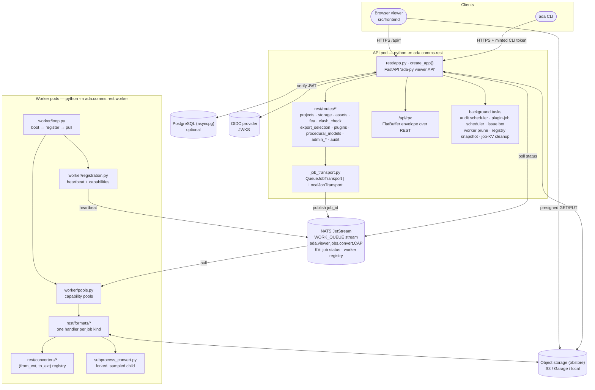
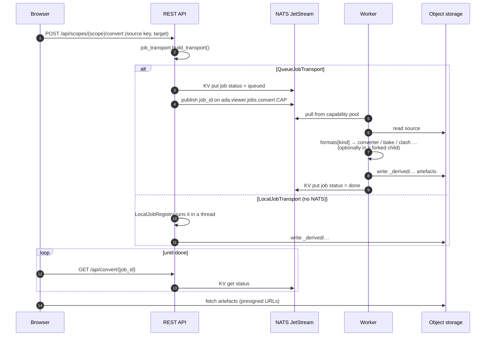
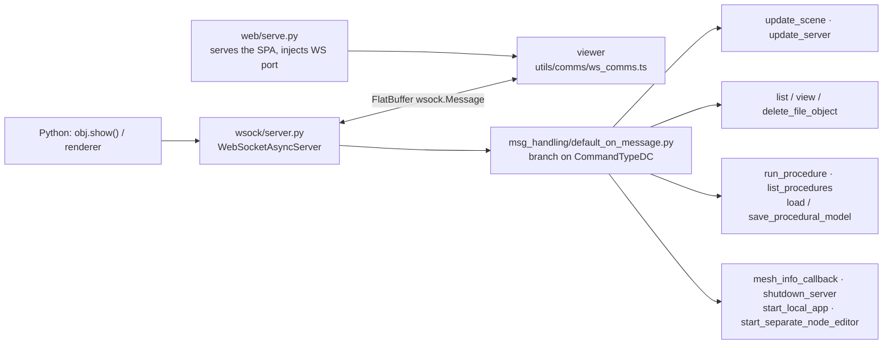
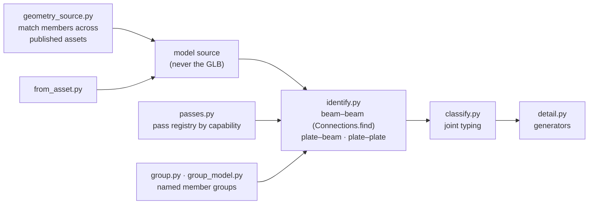

# Viewer platform

The same `ada` library runs behind two server set-ups:

- **Desktop / notebook:** a single-process WebSocket server (`ada.comms.wsock`) that pushes
  scenes to a viewer as FlatBuffer messages.
- **Hosted:** a FastAPI REST service (`ada.comms.rest`) with a NATS JetStream job queue, a pool
  of workers, object storage, an optional PostgreSQL database and OIDC login.

## Deployment view

## REST API (`ada.comms.rest`)

| Concern | Where | Notes |
|---|---|---|
| App factory | `app.py` (`create_app`) | Docs at `/api/docs`. Public: `/healthz`, `/api/config`. Everything else sits under `/api` behind `auth.current_user`. Conversion, utility, job polling (`/convert/{job_id}`), components and WASM audit routes are still defined in `app.py`. |
| Settings | `config.py` | `Settings` with `S3Config`, `LocalConfig`, `QueueConfig`, `AuthConfig`; read from `ADA_VIEWER_*` and `DATABASE_URL`. |
| Routers | `routes/*.py` | **Projects** (`/me`, `/projects`), **storage** (files, overlays, blobs, rename/move, derived, upload-url / upload-complete / upload-progress, download-url), **source nodes**, **assets** (providers, index, tree, attributes, geometry roll-up, build, publish, staging, unpublish), **fea** (`fea/artefacts`, `fea/artefact`, `fea/manifest`, `result-meta`), **clash** (clash-check, clash-detail, passes, checkers, geometry providers, connection specs), **export_selection**, **plugins / plugin_jobs / procedural_models**, **admin** (projects, users, settings, storage, compression, workers, corpora, plugin jobs) and **audit** (runs, schedules, perf + issue bot). Shared context lives in `deps.py` (`RestContext`). |
| Auth | `auth.py`, `scope.py` | Provider-agnostic OIDC JWT verification against the discovered JWKS. Admin role from a group claim. Users are upserted lazily by `sub`. The CLI uses minted tokens. With auth disabled, a synthetic local user is used. Access is scoped to *shared*, *project* or *user*. |
| Database | `db/pool.py`, `db/migrations.py`, `migrations/*.sql` | PostgreSQL via asyncpg. Numbered SQL migrations are applied under an advisory lock. Tables: users, projects, members, audit (log, runs, schedules, parity, issue rechecks), app settings, profiling stats, corpora, worker packages, procedural models / equipment types / system templates / engines, source nodes, plugin job schedules. **Optional:** without a DB the API runs shared-only and DB-backed routes return 503. |
| Storage | `storage.py` | obstore `S3Store` (S3, Garage) or `LocalStore` (`ADA_VIEWER_STORAGE_KIND`), with gzip helpers. Sources and derived artefacts share one key space (`_derived/...`). |

## Jobs

- **Transport** (`job_transport.py`): `QueueJobTransport` (NATS) or `LocalJobTransport`
  (in-process threads for a set of `LOCAL_FEATURES`: asset build/publish, clash
  check/detail, export selection, plugin jobs). The choice is made once at start-up.
- **Queue** (`queue.py`, `JobQueue`): a JetStream stream with WORK_QUEUE retention. The
  message body is just the job id. Status and the worker registry live in a KV bucket.
  Jobs go to capability subjects, so a worker only pulls what it can do.
- **Workers** (`rest/worker/`): `loop.py` boots, registers and pulls. `pools.py` has one pool
  per capability, fetches one job at a time and stops retrying a poison job after a limit.
  `registration.py` heartbeats the worker's capabilities (conversion matrix, utilities, clash
  passes/specs, asset concept providers), gated by `qualification.evaluate`. `routing.py`
  detects misrouted jobs.
- **Job kinds** (`rest/formats/__init__.py`): `convert` (fallback), `fea_artefacts`,
  `fea_meta`, `asset_build`, `asset_publish`, `component_build`, `procedural_*` (build,
  detail, relocations, xlsx import/export, model export, engine build), `equipment_bbox`,
  `plugin_job`, `clash_check`, `clash_check_asset`, `clash_check_group`, `clash_detail`,
  `clash_detail_group`, `export_selection`, `export_selection_asset`, `utility`, `parity`.
- **Converters** (`rest/converters/`): a `(from_ext, to_ext)` registry filled by
  `@converter`. Families: `ada_pairs` (passthrough, trimesh, ada-loadable sources),
  `ada_export` (GLB, IFC, Genie XML, GNX), `mesh_step` (STL, OBJ, STEP via OCC), `step_stream`
  (native STEP/IFC streams), `fea` (result decks), `pipelines` / `serializers` (tessellation
  engine options), `takeoff` (quantity take-off sidecar).
- **Isolation** (`subprocess_convert.run_isolated_convert`): conversions can run in a forked
  child, so a crash or memory blow-up cannot take the worker down. RSS, CPU and IO are
  sampled for the audit records.

## Desktop WebSocket server (`ada.comms.wsock`)

The messages are defined once in `src/flatbuffers/schemas/*.fbs` (root: `message.fbs`).
`src/flatbuffers/update_flatbuffers.py` runs `flatc` and the generators that write the Python
dataclasses, serialisers and deserialisers (`src/ada/comms/fb/`) and the TypeScript bindings
(`src/frontend/src/flatbuffers/`). The REST `/api/rpc` endpoint accepts the same envelope, so
the frontend can use either transport.

## Domain services

### Assets (`ada.assets`)

A tree-shaped asset store fed by **providers**: collection → subject → revision → files.

| Module | Role |
|---|---|
| `publish.py` | The provider plans, the core writes. The core stamps `published_by` and writes manifests last. |
| `index.py` | `fold_listing`: one storage prefix listing folded into the tree. |
| `rollup.py` | Geometry roll-up over the whole tree. |
| `projection.py` | The columnar `hierarchy.json` spine the viewer's tree reads. |
| `ifc/`, `builders`, `publishers`, `concepts`, `unpublish`, `keys` | The IFC provider and the build/publish/unpublish plumbing. |

`routes/assets.py` exposes the tree. Builds and publishes run as `asset_build` /
`asset_publish` jobs.

### Clash and joints (`ada.clash`)

Core identifies and types joints; generators detail them.

The REST routes in `routes/clash_check.py` enqueue `clash_*` jobs. Workers advertise the
passes and connection specs they support (`registration.py`).

### Plugins (`ada.plugins`)

The Python twin of the frontend plugin registry: `register_plugin_backend`,
`discover_plugins`, `plugin_backend_specs`, `register_plugin_artefact_contributor`,
`request_worker_capabilities`, plus external model providers. Plugins are loaded from
`ADA_WORKER_PRELOAD` modules and an entry-point group. `rest/plugin_registry.py` is the only
place the REST side touches the registry.

### Audit and issue bot

Every conversion leaves an audit row: its outcome, conversion provenance and the profiler
summary parsed from the child process log (`worker/audit.py`). Admins schedule audit runs on a
cron (`routes/admin_audit_schedules.py`, fired by the scheduler background task) and inspect
runs and performance (`admin_audit_runs.py`, `admin_audit_perf.py`). `audit_issue.py`
fingerprints failures and files or updates issues on GitHub or Forgejo (`issue_client.py`).
The `ada audit …` CLI commands fetch and reproduce runs.

## Deployment

| Artifact | Built from | Runs |
|---|---|---|
| Viewer / API image | `deploy/Dockerfile.viewer`: adacpp WASM wheel → adapy wheel → `npm run build:serve` → pixi `viewer-api-slim` env → debian-slim | `python -m ada.comms.rest` on :8080 (also serves the SPA) |
| Worker image | `deploy/Dockerfile.worker`: pixi `viewer-api` env, optional adacpp-from-source overlay | `pixi run -e viewer-api viewer-worker` |
| Docs image | `deploy/Dockerfile.docs`: pixi `docs` env → FEA report + Zensical site → nginx-unprivileged | Static site on :8080 |
| `*-fast` variants | Re-layer only changed `ada` sources on a published base | Same as above |
| Local stack | `deploy/docker-compose.dev.yml` | NATS (`-js`), api and worker, local storage, no DB |
| Cluster | `deploy/helm/adapy-viewer` | api, workers (+ extras), NATS, PostgreSQL, Garage (S3), ingress |

CI: `.forgejo/workflows/build.yaml` detects changed paths, builds the viewer, worker and
docs images (full or fast) and bumps image tags in the GitOps manifests. GitHub Actions run
the test suites, publish images to GHCR, release to PyPI, track profiling, and publish these
docs to GitHub Pages (`ci-pages.yml`).
