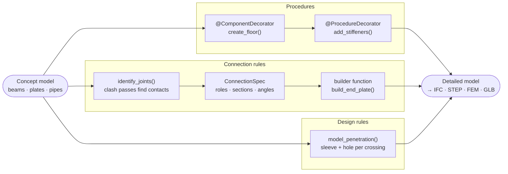
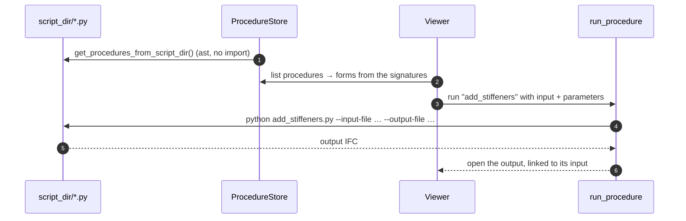

# Procedural modelling and rules

adapy lets you turn a simple concept model into a fully detailed one with code that you
write once and reuse. Each kind of design knowledge is a **plain Python function**, plugged
in at the point where it is needed:

| You want to… | Write a… | Registered with | Runs from |
|---|---|---|---|
| Generate or modify a model (add stiffeners, build a floor, …) | **procedure** or **component** | `@ProcedureDecorator` / `@ComponentDecorator` | its own CLI, Python, the viewer's procedure list |
| Decide *where* members connect and *what detail* to build there | **connection rule** | `@register_connection(ConnectionSpec(...))` | `identify_joints` in Python, clash check in Ada Studio |
| Find a new kind of contact (for example solid overlaps) | **clash pass** | `register_pass(ClashPass(...))` | the same clash check |
| Detail every place a pipe or duct crosses a deck or wall | **design rule** | `DesignRules(model_penetration=...)` | the [topology engine](topology_engine.md#pluggable-design-rules) |



## Procedures and components

A **component** creates new geometry and a **procedure** changes an existing model. Both are
ordinary functions that take files and parameters, decorated so that adapy can list them,
show their inputs as a form, and run them:

```python
import pathlib

import ada
from ada.comms.fb_wrap_model_gen import FileTypeDC
from ada.procedural_modelling.procedures_base import ProcedureDecorator, app


@ProcedureDecorator(
    inputs=dict(input_file=FileTypeDC.IFC),
    outputs=dict(output_file=FileTypeDC.IFC),
    options={"hp_section": ["HP180x8", "HP200x10", "HP220x12"]},
)
def main(
    input_file: pathlib.Path = None,
    output_file: pathlib.Path = None,
    hp_section: str = "HP180x8",
    stiff_spacing: float = 1.0,
) -> None:
    """A procedure to add stiffeners to all plates in the IFC file"""
    a = ada.from_ifc(input_file)
    for pl in a.get_all_physical_objects(by_type=ada.Plate):
        pl.parent / add_stiffeners(pl, stiff_spacing, hp_section)  # your own helper
    a.to_ifc(output_file)


if __name__ == "__main__":
    app()
```

The full script, including the `add_stiffeners` helper, is
[`examples/procedure_example/scripts/procedures/add_stiffeners.py`](https://github.com/Krande/adapy/blob/main/examples/procedure_example/scripts/procedures/add_stiffeners.py).

- **Every procedure is a command line tool.** The decorator registers the function with
  Typer, so the same script runs on its own:

    ```bash
    python create_floor.py --output-file floor.ifc --width 4 --length 6
    python add_stiffeners.py --input-file floor.ifc --output-file floor_stiffened.ifc --hp-section HP200x10
    ```

    The pair above makes a 4 × 6 m plate and then adds six HP200x10 stiffeners to it.

- **The viewer finds them by reading, not importing.** Point `ADA_PROCEDURES_SCRIPT_DIR`
  (or `[procedures] script_dir` in `ada_config.toml`) at a folder of scripts.
  `get_procedures_from_script_dir` parses each file and turns the signature into a form:
  `str`, `int`, `float`, `bool`, `pathlib.Path`, and `tuple`/`list`/`set` of those.
  `options` become drop-downs and the docstring becomes the description. A run is a
  subprocess, so a failing procedure cannot take the server down. Its output file is opened
  in the viewer, linked to the input it was made from.



## Connection rules as functions

A connection rule has two halves. The **spec** says which members it applies to: their
roles, kinds, section families and the angle between them. The **builder** is a plain function
that builds the detail for one pair of members. `register_connection` ties the two together:

```python
import ada
from ada.api.connections.spec import (
    AngleRange,
    ConnectionSpec,
    MemberCriteria,
    MemberKind,
    MemberRole,
    register_connection,
)

# When does it apply? Two I-beams meeting at roughly a right angle.
END_PLATE = ConnectionSpec(
    name="example.end_plate",
    roles=(
        MemberCriteria(role=MemberRole.LANDING, kind=MemberKind.BEAM, section_in=frozenset({"I"})),
        MemberCriteria(
            role=MemberRole.INCOMING,
            kind=MemberKind.BEAM,
            section_in=frozenset({"I"}),
            angle_to_role=MemberRole.LANDING,
            angle_range=AngleRange(min_deg=80.0, max_deg=100.0),
        ),
    ),
    tags=frozenset({"example"}),
)


# What does it build? A plate at the joint, square to the incoming beam.
@register_connection(END_PLATE)
def build_end_plate(*, landing, incoming, centre, name=None, thickness=0.02, **_):
    sec = incoming.section
    w, h = sec.w_top + 0.04, sec.h + 0.04
    plate = ada.Plate(
        f"{name or incoming.name}_end_plate",
        [(-w / 2, -h / 2), (w / 2, -h / 2), (w / 2, h / 2), (-w / 2, h / 2)],
        thickness,
        origin=centre,
        normal=incoming.xvec,
        xdir=landing.xvec,
    )
    return ada.Part(name or f"{incoming.name}_joint") / plate
```

Applying it to a model: find the joints, ask which rules apply to each one, and build:

```python
from ada.api.connections.spec import get_registered
from ada.clash import identify_joints
from ada.clash.match import applicable_specs, detail_pairs
from ada.clash.options import ClashOptions

p = ada.Part("frame") / [
    ada.Beam("girder", (0, 0, 0), (4, 0, 0), "IPE300"),
    ada.Beam("joist", (2, 0, 0), (2, 3, 0), "IPE200"),
]
a = ada.Assembly("example") / p

for joint in identify_joints(a, ClashOptions(include_plate_joints=False)).joints:
    for match in applicable_specs(joint.members, landing=joint.landing):
        rule = get_registered(match.spec)
        for landing, incoming in detail_pairs(rule.spec, joint):
            p.add_part(rule.fn(landing=landing, incoming=incoming, centre=joint.centre))

a.to_ifc("frame_with_details.ifc")  # girder, joist and the joist's end plate
```



```mermaid
flowchart LR
    M(["Model"]) --> PASSES["clash passes<br/>beam–beam · plate–beam · plate–plate<br/>+ registered passes"]
    PASSES --> J["joints<br/>members · landing · centre"]
    J --> MATCH["applicable_specs()<br/>roles · sections · angles · predicate"]
    MATCH --> PAIRS["detail_pairs()<br/>(landing, incoming) per spec"]
    PAIRS --> FN["builder function<br/>or NotApplicable → next spec"]
    FN --> D(["detail Part<br/>→ model · IFC · GLB"])

    click PASSES href "https://github.com/Krande/adapy/blob/main/src/ada/clash/passes.py" "Pass registry"
    click J href "https://github.com/Krande/adapy/blob/main/src/ada/clash/identify.py" "identify_joints"
    click MATCH href "https://github.com/Krande/adapy/blob/main/src/ada/clash/match.py" "Matching"
    click FN href "https://github.com/Krande/adapy/blob/main/src/ada/clash/detail.py" "Building details"
```

- **Declining is part of the contract.** A builder raises `NotApplicable` when its spec
  matched but its own finer conditions do not hold. The next applicable rule, by `priority`,
  then gets the joint.
- **Narrow rules beat broad ones.** Rules are ordered by `priority`, and a rule that names
  sections or angles is offered before a general one.
- **The built-in rules are written the same way.** See `ada/clash/builtin_specs.py`, for
  example the girder gusset rule, which binds only to girders meeting at 30–150°.
- **In Ada Studio** the same registry drives the clash check. It lists the joints, shows
  which rules apply to each, and builds the chosen details in a worker.

### Finding new kinds of contact

Joints come from **clash passes**. A pass is also a function, from a part to the contacts it
finds. Register it with a capability, and it runs only when a clash check asks for it:

```python
from ada.clash.identify import _Found
from ada.clash.passes import ClashPass, register_pass


def solids_overlap(part, options, *, beams, plates):
    for a, b in my_overlap_search(beams, plates):  # your search
        yield _Found(members=[a, b], centre=(0.0, 0.0, 0.0), origin="", contact={"penetration_depth": 0.002})


register_pass(ClashPass(name="solid-overlap", label="Solids overlapping", capability="my-cap", fn=solids_overlap))
```

## Penetrations as design rules

The old example on this page cut a hole through a reinforced deck wherever a pipe crossed
it. That job now belongs to the topology engine. Its design rules are functions too: given
one crossing (`Penetration`: system, point, normal and the face it crosses), return the detail
as a `Part`:

```python
import ada
from ada.topology import DesignRules, run_design


# A short sleeve centred on the crossing point, along the crossed face normal.
def model_penetration(pen, name):
    p1 = tuple(pen.point - pen.normal * 0.15)
    p2 = tuple(pen.point + pen.normal * 0.15)
    return ada.Part(name) / ada.PrimCyl(f"{name}_sleeve", p1, p2, r=0.1)


result = run_design(systems, cell_graph=cg, grid=grid, rules=DesignRules(model_penetration=model_penetration))
```

`ada.topo_model.penetration.standard_penetration_modeller` is the reference rule. It also cuts
the hole in the crossed plate (`pen.face.associated_part.add_boolean(...)`).
[Topology engine → Pluggable design rules](topology_engine.md#pluggable-design-rules) covers
the planning phase, routing rules and the named rulesets that Ada Studio offers.
