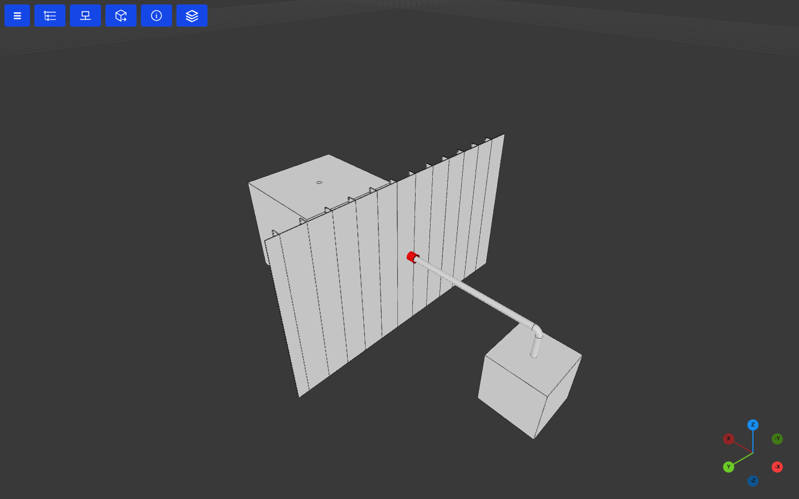

# Procedural modelling

Describe a model by its spaces and what connects them. The topology engine builds the
structure, routes the systems, and finds every place a system crosses a wall or deck. The
detail at each crossing is a plain Python function of yours.

The smallest case: two cells that share one wall, and a pipe from a pump in one cell to a
tank in the other, so it has to cross that wall. The detail function cuts a circular hole in
the wall and reinforces it with a thin-walled sleeve:

```python
--8<-- "examples/penetration_detail.py:model"
```



- **`TopologyBuilder.from_prim_boxes`** turns boxes into cells, and the faces they share into
  internal walls. The `SteelStru` blueprint builds them as steel: columns, girders, decks and a
  stiffened plate for the shared wall.
- **`run_design`** routes the pipe through the cell grid and finds where it crosses a wall.
  For each crossing it calls `model_penetration` with a `Penetration`: the system, the point,
  the face normal and the face, whose `associated_part` is the wall that was built for it.
- **`penetration_detail`** is the whole rule. It cuts the wall plates and returns the
  detail part. Swap in another function for another standard, or use the reference one,
  `ada.topo_model.standard_design_rules()`, which also handles cable trays and ducts.

Run it with `python examples/penetration_detail.py`, which opens the model in the viewer.
[Topology engine](topology_engine.md) covers blueprints, routing rules, equipment and whole
models built from a document.
