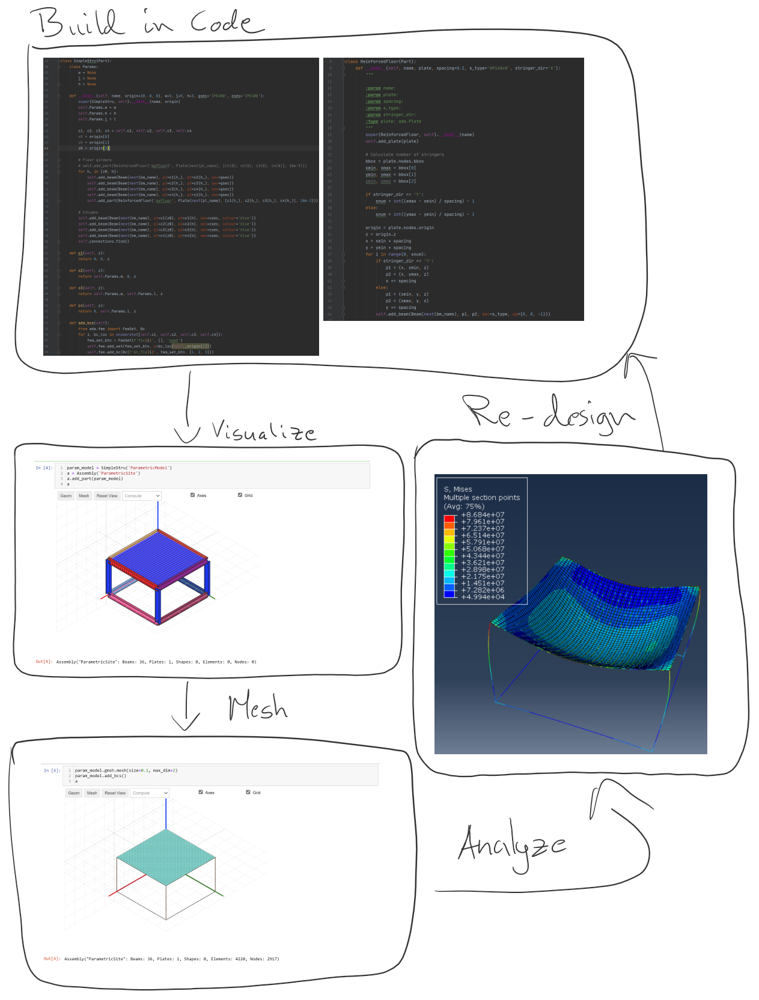

# Advanced Design & Analysis (ADA)

A python library for structural analysis and design that focus on interoperability between
IFC and various Finite Element formats.

!!! note
    This library is still undergoing significant development so expect there to be bugs and breaking changes.

## Build, Analyze and Postprocess in Code

## Where to start

- **Modelling:** the [primitives](documents/notebooks/design/primitives/box.md) and
  [modelling](documents/notebooks/design/parts_and_assemblies.md) notebooks. Each one has an
  interactive 3D viewer and can be downloaded and run.
- **Finite element analysis:** [supported solvers](documents/fea/fea_software.md) and the
  [FEA verification report](documents/fea/fea_verification.md).
- **How adapy is built:** the [architecture overview](documents/architecture/index.md).
