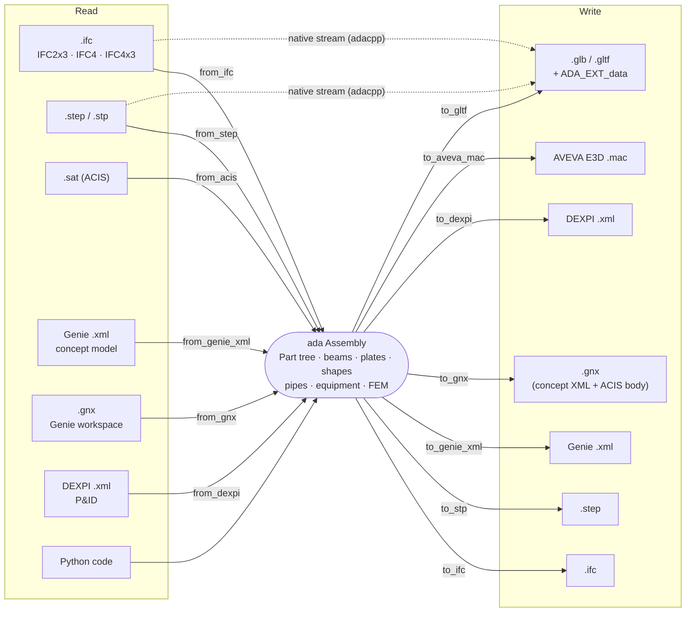
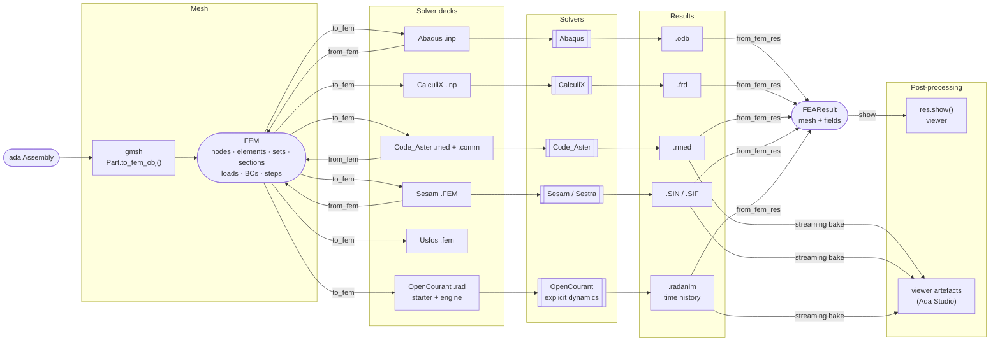
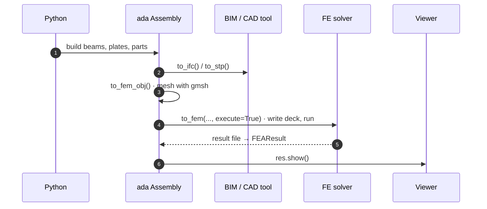

# Path to Software Agnosticism

The aim is that you can start a design in the tool of your choice and carry it, without
retyping, into any FE solver adapy supports and back out to any CAD or BIM tool that needs
it. adapy is the hub in the middle: every format is read into the same object model and
written out of it, so any input can reach any output.

The diagrams below show which formats go in and out, and through which functions. Boxes are
underlined where they link to the code or to the page that explains them. **Enlarge** a
diagram to zoom, and hover a box to trace what it connects to.

## CAD and BIM



## Finite element analysis



The FE model can also be filled from an existing deck (`ada.from_fem`), so one solver's
deck becomes another's: read an Abaqus `.inp`, write a Sesam `.FEM`. Code_Aster, CalculiX
and OpenCourant (explicit dynamics) are open source (see [FEA Software](fea/software.md)).
Abaqus and Sesam need their own licences.

## One fluent operation

The original goal still holds: design in Python, hand the same model to a BIM tool and an FE
solver, and look at the results, all in one script:

```python
import ada
from ada.base.types import GeomRepr

bm = ada.Beam("bm1", (0, 0, 0), (3, 0, 0), "IPE400", ada.Material("S420"))
p = ada.Part("structure") / bm
a = ada.Assembly("cantilever") / p

a.to_ifc("cantilever.ifc")  # to any IFC viewer or BIM tool
a.to_stp("cantilever.stp")  # to any CAD tool

bm.concept_fem.fix_end("n1")  # a support on the design object, not on mesh nodes
p.fem = p.to_fem_obj(0.1, GeomRepr.LINE)  # mesh with gmsh
a.fem.add_step(ada.fem.StepEigen("eig", num_eigen_modes=10))
res = a.to_fem("cantilever", "code_aster", overwrite=True, execute=True)

res.show()  # the mode shapes in the viewer: a browser tab from a script, inline in Jupyter
```



## Format matrix

| Format | Extensions | Read | Write | Python | `ada convert` name |
|---|---|:-:|:-:|---|---|
| IFC | `.ifc` | ✓ | ✓ | `from_ifc` / `Assembly.to_ifc` | `ifc` |
| STEP | `.step`, `.stp` | ✓ | ✓ | `from_step` / `to_stp` | `step` |
| ACIS | `.sat`, `.acis` | ✓ | inside `.gnx` | `from_acis` | `acis` |
| Genie XML | `.xml` | ✓ | ✓ | `from_genie_xml` / `to_genie_xml` | `xml` |
| Genie workspace | `.gnx` | ✓ | ✓ | `from_gnx` / `to_gnx` | `gnx` |
| DEXPI | `.xml` | ✓ | ✓ | `from_dexpi` / `to_dexpi` | — |
| AVEVA E3D macro | `.mac` | | ✓ | `Part.to_aveva_mac` | — |
| glTF | `.glb`, `.gltf` | | ✓ | `to_gltf` | `gltf` |
| Abaqus | `.inp` | ✓ | ✓ | `from_fem` / `to_fem(…, "abaqus")` | `abaqus` |
| CalculiX | `.inp` | | ✓ | `to_fem(…, "calculix")` | `calculix` |
| Code_Aster | `.med`, `.rmed` | ✓ | ✓ | `from_fem` / `to_fem(…, "code_aster")` | `code_aster` |
| Sesam | `.FEM`, `.SIF` | ✓ | ✓ | `from_fem` / `to_fem(…, "sesam")` | `sesam` |
| Usfos | `.fem` | | ✓ | `to_fem(…, "usfos")` | `usfos` |
| OpenCourant | `.rad` | | ✓ | `to_fem(…, "opencourant")` | `opencourant` |
| FE results | `.rmed`, `.frd`, `.SIN`, `.SIF`, `.odb`, `.radanim` | ✓ | | `from_fem_res`, then `.show()` | — |

The same conversions are available from the command line, without writing any Python:
`ada convert model.ifc model.FEM` (see [Command line interface](cli.md)).
