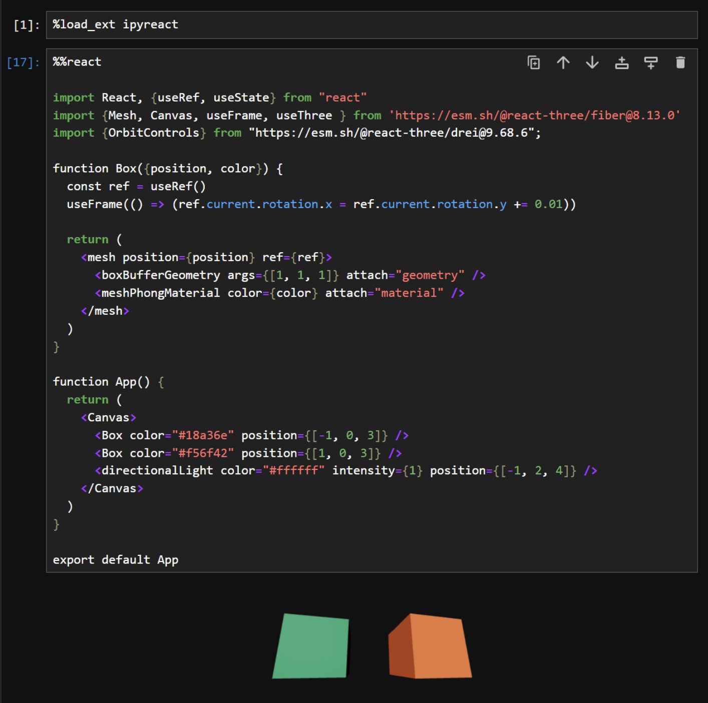
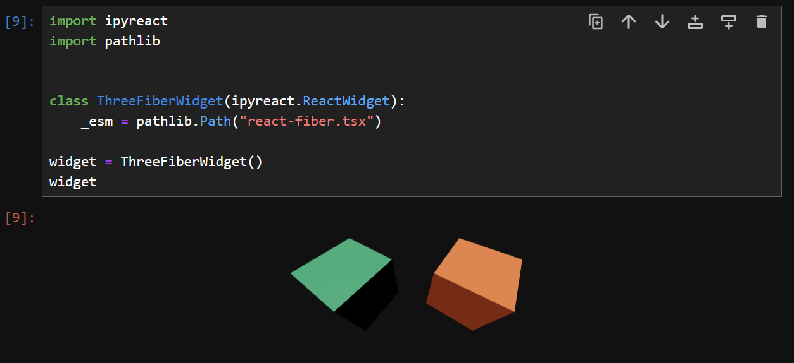

# IPYReact + Three-Fiber

The experiments with three-fiber done so far are promising. 

However, it seems that adding the <OrbitControls/> component yields an 
error -> https://github.com/widgetti/ipyreact/issues/37

