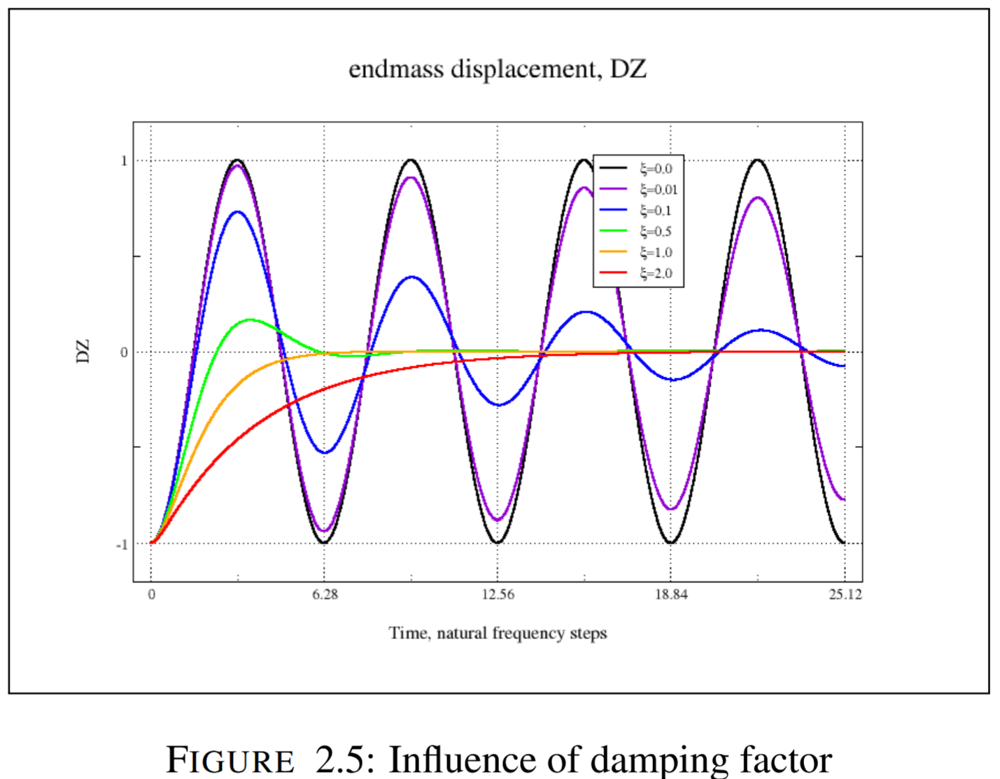
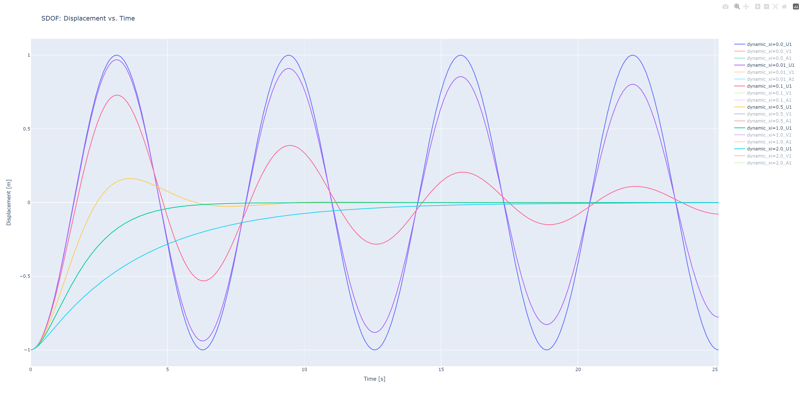

# Single Degree of Freedom

This Single Degree of Freedom example is based on "mass spring" example in ch. 2.5 from the 
"Beginning DYNA[mics] with code_aster" by Jean-Pierre Aubrey.

The example demonstrates a transient modal analysis of a mass spring system with varying damping ratio's. 

Remaining work to further improve this example:

* [ ]: Create a "transient modal analysis" Step definition in Ada-py as a subclass of `Step`. 
* [ ]: Find the equivalent transient modal analysis input file setup for abaqus for a 1:1 comparison.  

