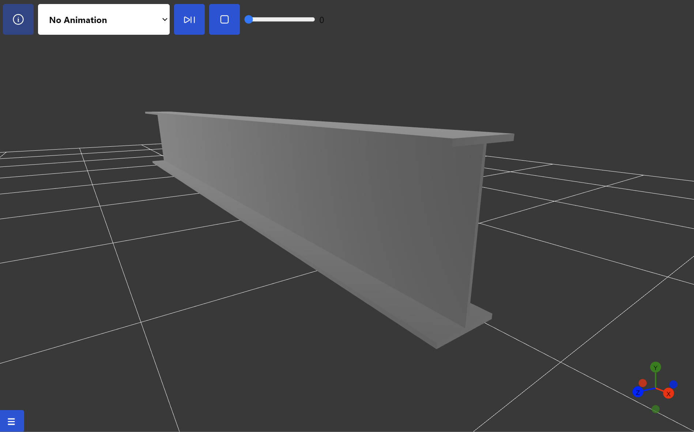

## Eigenvalue Analysis

A simple cantilevered beam is subjected to eigenvalue analysis with a total of 
{{__num_modes__}} eigenmodes requested.

The beam model will be analyzed by varying the following parameters:

- Mesh type (Solid, Shell, Line)
- Mesh element types (TET, HEX, TRI, QUAD)
- Mesh element order (1st and 2nd order)
- Reduced integration elements (R)
- Different FEA solvers (Calculix, Code Aster, Abaqus, Sesam)

### Model Description

Model object: {{__geom_specifics__}}

### Summary

This section presents a comparison between the calculated results from the 
eigenvalue analysis of a cantilever beam using the different FEA tools. 

Note! The `Sestra` and `Abaqus` analyses are not performed as part of the github actions step. The
eigenmode results are kept in cached json files and imported during the compilation of the report using __paradoc__.

{{__eig_compare_solid_o1__}}

{{__eig_compare_solid_o2__}}

{{__eig_compare_shell_o1__}}

{{__eig_compare_shell_o2__}}

{{__eig_compare_line_o1__}}

{{__eig_compare_line_o2__}}

Short description:

**Fem formats**

* ccx: Calculix
* ca: Code Aster
* ses: Sesam
* aba: Abaqus

**Element Types**

* TET: Tetrahedrons
* HEX: Hexahedrons
* TRI: Triangle
* QUAD: Quadrilateral

**Reduced Integration**

All element types ending with capital R (QUAD**R**, HEX**R** etc.) are reduced integration elements.